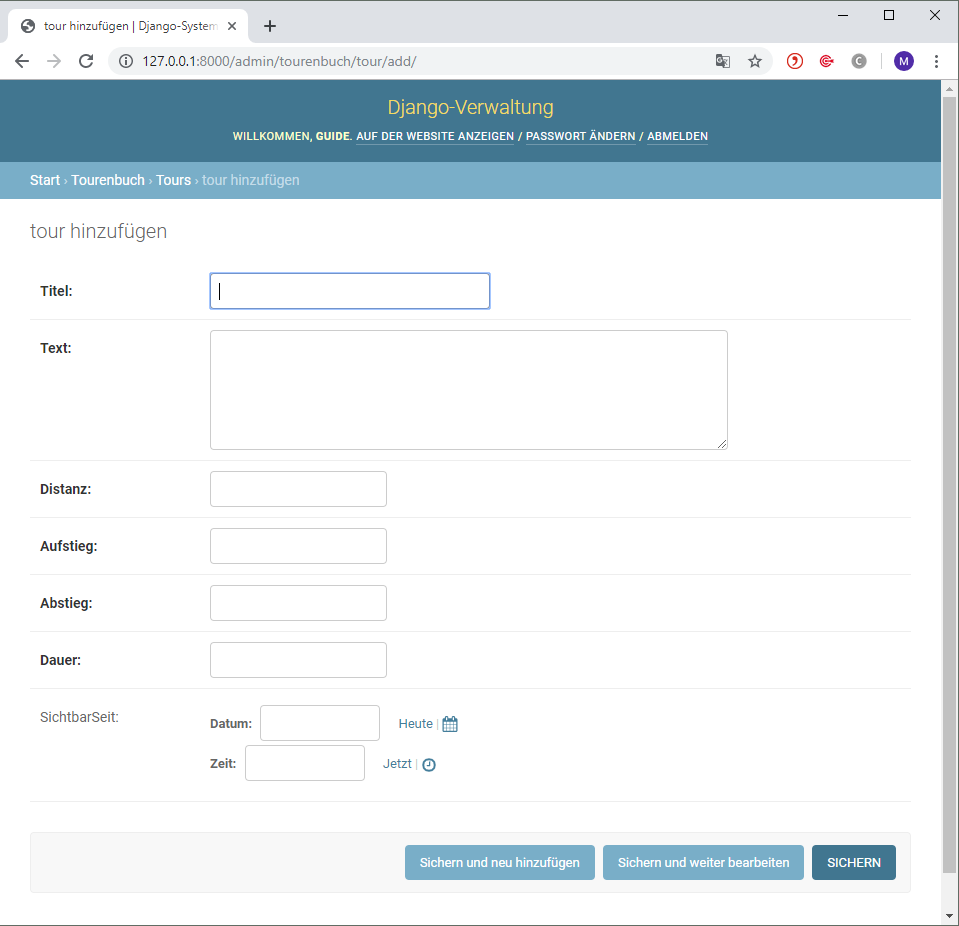
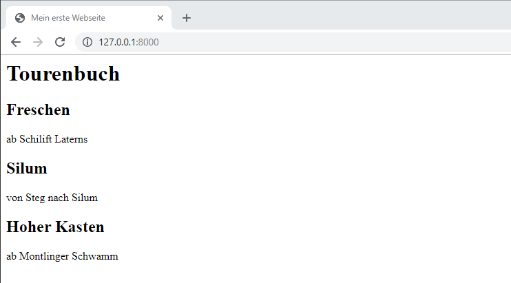
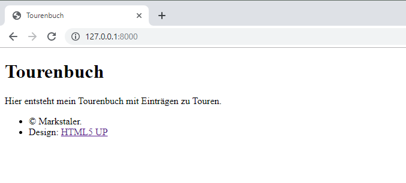

# Visualisierung

Um entscheiden oder handeln zu können sind Infomationen notwendig. Z.B. Energiemonitoring um die Effizenz zu beurteilen oder ein Niederschlagradar um eine geeignete Tourenwahl zu treffen. Werden Berechnungen oder Modellierungen ausgeführt so helfen diese Informationen ebenfalls Entscheidungen zu fällen. Im Ingenieurwesen ist dies in der Regel ein Diagramm. In den beiden Tutorial auf [www.pv4ing.ch](https://www.pv4ing.ch) sind die für uns relevanten Diagramme dargestellt. Zusätzlich sollte bei einer Visualisierung noch ein erklärender Text hinzu, nicht zu viel aber ein bisschen macht Sinn.

Denken wir an Energiemonitoring, so sollte die Visualisierung günstig sein, d.h. kein zusätzlicher Bildschirm und PC um den Zählerstand darzustellen. Das günstigste Display ist dies welches wir bereits dabei haben, das Mobil oder ein PC.

Deshalb bauen wir nicht ein eigenes GUI (Graphical User Interface), sondern erstellen eine Webpage. Auf der Messeinheit läuft ein Server, welcher die Information als Webpage darstellt und durch ein Mobil oder PC "angesurft" wird, welches die Informationen als Webpage über einen Browser darstellt.

Dabei ist neben der eigentlichen Information die Darstellung der Webpage wichtig um eine gute Lesbarkeit auf unterschiedlichen Geräten (PC, Notebook, Smartphone) zu erreichen. Dies wird als Responsiv Design bezeichnet.


## Leistsatz

Das Bauen einer Website kann zu einer sehr aufwändigen Sache werden, vorallem wenn wir uns in der Gestaltung verlieren. Deshalb einige Leitsätze:

1. Konzentration aufdas s Wesentliche: Was ist die Kernaussage der Webpage? Desgin wird "zugekauft"

2. Effektiv

3. Für jeden Handgriff das richtige Werkzeug

Der erste Punkt hat nicht mit programmieren oder Webpage zu tun.  Hierfür nimmt man Papier und Bleistift um die Kernaussage zu skizziern.

Bei zweiten Punkt "Effektiv" geht es daraum in kurzer Zeit eine Webpage zu erstellen. dies heisst Einfachheit im Aufbau mit wenig Code. Dies wird durch Python unterstützt da Python selbst dieses Ziel verfolgt beschrieben als "The Zen of Python":

1. Beautiful is better than ugly. 

2. Explicit (ausdrücklich) is better than implicit (indirekt).

3. Simple is better than complex. 

4. Complex is better than complicated. 

5. Flat is better than nested (verschachtelt).

Es gibt noch weitere Punkte, gib auf der Python Konsole folgendes ein:

`import this`

Der dritte Punkt "die richtigen Werkzeuge" zu verwendet unterstützt ein effektives arbeit. Das heisst auch das wir nicht das Selbe zweimal machen. Ein geschriebener Code sollte mehrmals für unterschiedliche Webpages einsetzbar sein. Dieses Prinzpip wird als "Don't repeat yourself (DRY)" bezeichnet.

## Webframework

Zur Erstellung von Webpages wird deshalb ein Webframework verwendet. Dies ist ein Baukastensystem mit einer Vielzahl nützlicher Werkzeuge wie Benutzerverwaltung, Formulare, Upload von Dateien und voralllem ein integrierter Entwicklungsserver um die Webpage schnell und einfach darzustellen ohne dem Aufsetzten eines Servers.

Der erste Schritt hierzu ist die Auftrennung von *Information*  und der *Darstellung*, wodurch beide Blöcke wiederverwendbar sind. Selbe Darstellung mit anderen Informationen oder selbe Informationen bei unterschiedlichen Darstellungen.


Als Webframework verwenden wir Djano basierend auf Python. Dies Framework wird bei hunderten Webpages eingesetzt wie Youtube, Dropbox, Google, Netflix, Spotify, Pinterest, NASA, uvm. Der Untertitel von Django heisst "The web framework for perfectionists with deadlines" und zeigt die Stärken von Django, wie:

- Schnell umsetzbar mit wenig Code

- Sicherheit inbegriffen

- Skalierbar 

- Vielfach erprobt und bewährt

Djanog ist benannt nach dem Gitaristen Django Reinhardt.


## Architektur Django

Die Architektur von Django teilt die *Darstellung (Template)* von den *Informationen (Model)*, welche, je nach Anfrage (request) unterschiedlich zusammengebaut (*View*) werden. Das Konzept wird als MTV bezeichnet für *Model, Template, View* und ist eine lose gekoppelte Struktur, sodass einzelne Teile wiederverwendet werden können.


# 

### View

Die View ist die Programmeinheit bei Django, welche die Webpage zusammenbaut und darstellt, deshalb view. Hier werden auch die Anfragen (request) behandelt und die Adresse geprüft.

In der allgemeinen Literatur wird das MTV-Modell häufiger als MVC-Modell verwedet für Model, View, Control. Hier entspricht View dem DjangoTemplate und Control der Django View.

### Template

Das Template beinhaltet die Darstellung, das Design der Webpage. Dieses Template werden wir nicht bauen, sondern fertig beziehen. Eine Quelle ist [www.html5up.net](http://www.html5up.net).

### Model

Unter Model werden die Informationen verstanden. Diese werden als Daten in einer Datenbank abgelegt. Um auf die Daten zugreifen zu können sind Datenbankabfragen wie SQL notwendig, diese sind jedoch nicht einfach und Django soll einfach sein. Deshalb wird die Information als Model definiert um so auf die Daten zugreifen zu können unabhängig der Datenbankstruktur im Hintergrund.

Die Modellierung erfolgt über Objekte.

#### Was sind Objekte?

Ein Objekt ist eine Sammlung von Eigenschaften und Aktionsmöglichkeiten (Funktionen/Methoden), das anhand einer Vorlage (Klasse) erstellt wird. Das klingt erst einmal komisch, aber hier haben wir gleich ein Beispiel.

Wenn wir zum Beispiel ein Fahrrad modellieren wollen, erschaffen wir eine Objektvorlage `Fahrrad`, eine Art Blaupause oder Schema, nach welcher zukünftig jedes spezifische Fahrradobjekt erstellt werden kann. Die Vorlage beschreibt typische Eigenschaften von einem Fahrrad, z.B. `farbe`, `typ` (z.b. Tourenrad, Mountainbike, Rennrad) und `anzahlService` welches die gemachten Service mitzählt.

Jedes Objekt der Vorlage `Fahrrad` soll natürlich auch einige Aktionsmöglichkeiten besitzen: `servicegemacht`. Dies sieht dann so aus:

    Fahrrad
    --------
    farbe
    typ
    anzahlService
    servicegemacht()

In Pythonschreibt man wie folgt:

```python
class Fahrrad:
    farbe = 'gelb'
    typ  = 'rennrad'
    anzahlService = 0

    def servicegemacht(self):
        self.anzahlService = self.anzahlService + 1
```

Mit diesem Code hast du eine Vorlage definiert. Nun erzeugst du ein Objekt `velo`.

    velo = Fahrrad()

Die Eigenschaften von `velo` kann du abfragen indem du `velo.anzahlService`eingibst. Wenn du nun einen Service gemacht hast, d.h. die Funktion aufgerufen hast (`velo.servicegemacht()`), so erhöht sich die `anzahlService`. Probiere es aus.

Was jedoch nicht schön ist, dass alle Objekte welche wir nun erzeugen die gleiche Farbe und den gleichen Fahrradtyp enthalten. Dies ändern wir nun:

```python
class Fahrrad:
    def __init__(self, neueFarbe, neuerTyp):
        self.farbe = neueFarbe
        self.typ  = neuerTyp
        self.anzahlService = 0  

    def servicegemacht(self):
        self.anzahlService = self.anzahlService + 1
```

Nun können wir unterschiedliche Fahrräder von der Vorlage erzeugen. Die Frage und den Fahrradtyp definieren wir, wenn wir ein neues Objekt erzeugen.

    velo = Fahrrad('grün', 'Tourenrad')

Dabei müssen wir die Methode `_init_` nicht explizit aufrufen, sondern einfach die Werte in Klammern übergeben, wenn das Objekt erzeugt wird, basierend der Vorlage.

# Einrichten der Werkstatt

Zum Leitsatz 3 "Für jeden Handgriff das richtige Werkzeug" richten uns zuerst eine Arbeitsumgebung, ein *virtual enviroment* ein. Dies legt ein Ordner an indem unsere Python, Django, Bokeh Programme mit definierter Verion abgelegt sind. Sollten wir auf dem PC später mal ein Update durchführen, so bleibt unser Projekt trotzdem auf dem Versionsstand auf dem wir es gebaut haben.

Dies ist jetzt ein Mehraufwand, genau jetzt wo so viel Neues auf uns zukommt, aber es macht sich bezahlt. Wenn du später auf ein Projekt zurückgreifen möchtst haben sich die Versionen weiterentwickelt und der ürspüngliche Projekt-Code läuft nicht mehr, was nicht nur ärgerlich, sondern sehr zeitaufwändig ist. Deshalb "frieren" wir den aktuelle Stand der Entwicklungsumgebung ein. 

Wir erstellen zuerst unser Projektverzeichnis `djangoProjekt`. In diesem Verzeichnis erstellen wir eine virtuelle Umgebung namens `myvenv`. Im Anaconda-Paket ist die notwendige Software 'venv 'enthalten. Wir starten Python und weisen dieses an (mit -m) das die Software 'venv' ausgeführt werden soll:

    python -m venv myvenv

Nun starten wir die virtuelle Umgebung in unserem Projektverzeichnis mit 

    D:\djangoProjekt> myvenv\Scripts\activate

Damit die verwendeten Versionen der auf dem gewünschten Stand sind und dieser dokumentiert ist, erstellen wir eine *neue* Textdatei `swpakete.txt`. Darin listen wir die SW-Pakete mit den Versionen:

    pip
    Django==2.2.1
    bokeh==1.3.4 

Nun aktualisieren:

     pip install -r swpakete.txt

Nun sind wir eingerichtet. Mit `pip list`  kannst du die aktuell, installierten Versionen ansehen. 

# 1. Projekt anlegen

Die Funktionsweise von Django erklären wir indem wir ein Tourenbuch erstellen, als Webpage! Für die Webpage legen wir zuerst ein Ordner bzw. ein Projekt an. Anschliessend definieren wir, wie die Anfragen, d.h. die URLs behandelt werden und dann die Webpage als View generiert wird. Zuvor benötigen wir aber Informationen, welche als Modelle definiert werden. Hier unterstützt uns Django-Administration. Am Ende kümmern wir uns dann um die Darstellung. Wir führen 8 Schritte durch:

1. Projekt anlegen

2. Modelle

3. Django-Administration

4. URLs

5. Views

6. Datenbankabfrage

7. Dynamische Daten in Templates

8. Darstellung 

Die ersten 7 Kapitel basieren auf dem [Tutorial Djangogirls](https://tutorial.djangogirls.org/de/) lizenziert unter [Creative Commons Attribution-ShareAlike 4.0 International License](https://creativecommons.org/licenses/by-sa/4.0/). 

Der erste Schritt ist, ein neues Django-Projekt zu starten. Im Grunde bedeutet das, dass wir einige Skripte ausführen werden, die Django zur Verfügung stellt, um ein Skelett eines Django-Projekts für uns zu erzeugen. Das Projekt beinhaltet einen Haufen von Verzeichnissen und Dateien, die wir später verwenden werden.

Die Namen einiger Dateien und Verzeichnisse sind sehr wichtig für Django, da sich Django durch die Verzeichnisnamen und Dateinamen orientiert. Wir nennen unserer Seite `mysite` (können diese beliebig bezeichnen).

    (myvenv) ~/djangoProjekt> django-admin startproject mysite .

Der Punkt `.` ist sehr wichtig, weil er dem Skript mitteilt, dass Django in deinem aktuellen Verzeichnis installiert werden soll. (Der Punkt `.` ist eine Schnellreferenz dafür.)

`django-admin.py` ist ein Skript, welches Verzeichnisse und Dateien für dich erstellt. Du solltest jetzt eine Verzeichnisstruktur haben, die folgendermaßen aussieht:

    djangoProjekt
    ├───manage.py
    ├───mysite
    │        settings.py
    │        urls.py
    │        wsgi.py
    │        __init__.py
    ├───myvenv
    └───swpakete.txt

`manage.py` ist ein Script, das das Management deines Projektes unterstützt. Mit dem Script bist du unter anderem in der Lage, den Webserver auf deinem Rechner zu starten, ohne etwas Weiteres installieren zu müssen.

Die Datei `settings.py` beinhaltet die Konfiguration deiner Website.

Die `urls.py` Datei ist die Datei welche die einkommenden Anfragen (request) überprüft.

Lass uns kurz die anderen Dateien vergessen - wir werden sie nicht verändern. Denk aber dran, sie nicht versehentlich zu löschen!

Der `myvenv`-Ordner und die `swpakete.txt`-Datei kommen von der virtuellen Umgebung, nicht von Django.

## Einstellungen anpassen

Wir machen nun ein paar Änderungen in `mysite/settings.py`. Öffne die Datei mit dem Code-Editor, den du schon installiert hast.

Es wäre schön, wenn die richtige Zeit auf deiner Webseite eingestellt ist. Gehe zur [Zeitzonen-Liste auf Wikipedia](https://en.wikipedia.org/wiki/List_of_tz_database_time_zones) und kopiere die für dich geltende Zeitzone (Spalte "TZ"), z.B. `Europe/Zurich`.

Suche in `settings.py` die Zeile, die `TIME_ZONE` enthält und ändere sie ab, um deine eigene Zeitzone auszuwählen. Zum Beispiel:

```python
TIME_ZONE = 'Europe/Zurich'
```

Ein Sprachkennung besteht aus einem Kürzel für die Sprache, z.B. `en` für Englisch oder `de` für Deutsch, und einem Länder-Kürzel z.B.  `ch` für die Schweiz. Falls Englisch nicht deine Muttersprache ist, kannst du damit die Standard-Knöpfe und -Meldungen von Django auf deine Sprache wechseln. Der "Cancel"-Knopf würde dann in diese Sprache übersetzt (und z.B. bei Deutsch mit "Abbrechen" beschriftet). [Django enthält viele fix-fertige Übsersetzungen](https://docs.djangoproject.com/en/2.2/ref/settings/#language-code).

Wenn du eine andere Sprache als Englisch willst, ändere die Sprachkennung, indem du die folgende Zeile änderst:

```python
LANGUAGE_CODE = 'de-ch'
```

Ausserdem müssen wir einen Pfad für statische Dateien festlegen. (Über statische Dateien und CSS lernst du später in diesem Tutorial etwas.) Geh hinunter zum *Ende* der Datei und füge direkt unter dem `STATIC_URL`-Eintrag einen neuen Eintrag namens `STATIC_ROOT` ein:

```python
STATIC_URL = '/static/'
STATIC_ROOT = os.path.join(BASE_DIR, 'static')
```

Wenn `DEBUG` auf `True` gesetzt ist und `ALLOWED_HOSTS` leer, dann wird der "Host" gegen `['localhost', '127.0.0.1', '[::1]']` validiert. Falls die Seite später im Internet läuft ist hier der Hostname (z.B. .meineSeite.ch) anzugeben.

```python
ALLOWED_HOSTS = ['127.0.0.1', '.meineSeite.ch']
```

## Eine Datenbank erstellen

Es gibt viele verschiedene Datenbank Programme, welche die Daten unserer Website verwalten können. Wir werden die Standard-Datenbanksoftware nehmen, `sqlite3`.

Das sollte schon in der `mysite/settings.py`-Datei eingestellt sein:

```python
DATABASES = {
    'default': {
        'ENGINE': 'django.db.backends.sqlite3',
        'NAME': os.path.join(BASE_DIR, 'db.sqlite3'),
    }
}
```

Um eine Datenbank für unseren Blog zu erstellen, müssen wir folgenden Befehl in der Konsole ausführen (Dazu müssen wir in dem `djangoProjekt`-Verzeichnis sein, in dem sich auch die `manage.py`-Datei befindet). Wenn alles glatt läuft, sollte das so aussehen:

    (myvenv) ~/djangoProjekt$ python manage.py migrate
    Operations to perform:
      Apply all migrations: auth, admin, contenttypes, sessions
    Running migrations:
      Rendering model states... DONE 
      Applying contenttypes.0001_initial... OK
      Applying auth.0001_initial... OK
      Applying admin.0001_initial... OK
      Applying admin.0002_logentry_remove_auto_add... OK 
      Applying contenttypes.0002_remove_content_type_name... OK 
      Applying auth.0002_alter_permission_name_max_length... OK 
      Applying auth.0003_alter_user_email_max_length... OK 
      Applying auth.0004_alter_user_username_opts... OK  
      Applying auth.0005_alter_user_last_login_null... OK 
      Applying auth.0006_require_contenttypes_0002... OK
      Applying auth.0007_alter_validators_add_error_messages... OK
      Applying auth.0008_alter_user_username_max_length... OK
      Applying auth.0009_alter_user_last_name_max_length... OK
      Applying sessions.0001_initial... OK

Und wir sind fertig! Zeit, unseren Webserver zu starten, um zu sehen, ob unsere Website funktioniert!

## Den Webserver starten

Kontrolliere, dass du in dem Verzeichnis bist, in dem die `manage.py`-Datei liegt (das `djangoProjekt`-Verzeichnis). Wir starten den Webserver, indem wir in der Konsole `python manage.py runserver` ausführen:

    (myvenv) ~/djangoProjekt$ python manage.py runserver

Jetzt wollen wir schauen, ob unsere Website funktioniert: Öffne deinen Browser (Firefox, Chrome, Safari, Edge oder was du sonst nutzt) und gib diese Adresse ein:

`http://127.0.0.1:8000/`

Glückwunsch! Du hast gerade deine erste Website erstellt und sie auf deinem Webserver laufen! Ist das nicht toll?


Beachte, dass ein Terminalfenster immer nur eine Sache zur selben Zeit erledigen kann, und in dem Terminalfenster, was du vorhin geöffnet hast, läuft gerade der Webserver. Und solange der Webserver läuft und auf einkommende Anfragen wartet, akzeptiert das Terminal zwar Texteingaben, aber es wird keine neuen Befehle ausführen. 

# 2. Modelle

Wir erstellen jetzt etwas, damit wir alle Tours von unserem Tourenbuch speichern können. Dies machen wir mit `Objekten`.  Ein Objekt besteht aus Eigenschaften und Aktionsmöglichkeiten (genannt `Methoden`) .Wir müssen folgende Fragen beantworten:  Welche Eigenschaften sollte er haben? Titel, Beschreibungstext, zurückgelegte Distanz und Aufstiegs- und Abstiegshöhe, sowie die Dauer für die Tour. Weiter der Zeitpunkt wann der Eintag veröffentlicht wurde. Dies sind Objekteigenschaften. Wir nennen das Objekt `Tour`, gross geschrieben wie bei Objekten üblich.

    Tour 
    -------- 
    titel 
    text
    distanz
    aufstieg
    abstieg
    dauer
    sichtbarSeit

Was für Dinge könnte man mit dem Toureneintrag machen? Es wäre schön, wenn wir eine `Methode` hätten, die den Tour zu veröffentlicht. Wir brauchen also eine `veroffentlichen`-Methode.

Da wir jetzt wissen, was wir erreichen wollen, können wir nun damit anfangen, es in Django zu formulieren!

## Ein Django-Model erstellen

Wir erstellen ein Django-Model, eine Vorlage. Mit dieser werden zukünftig einzelne Touren-Einträge bzw. Tourobjekte erstellt.

Ein "Modell" ist in Django ein Objekt einer speziellen Sorte – eines das in der `Datenbank` gespeichert wird. Eine Datenbank ist eine Sammlung von Daten. Dies ist ein Ort, an dem du Informationen zu Benutzern, deinen Toureneinträge usw. speichern wirst. Wir benutzen dafür eine SQLite-Datenbank. Das ist die Voreinstellung in Django – für uns wird das erst einmal ausreichen.

Du kannst dir ein Model wie eine Tabelle mit Spalten ("Feldern", englisch "fields") und Zeilen (Datensätzen) vorstellen.

### Eine Applikation für unser Tourenbuch

Um unsere Webseite aufgeräumt zu halten, werden wir eine eigene Anwendung für unser Projekt erstellen, wir nennen das eine Applikation. Wir wollen uns gleich daran gewöhnen, alles ordentlich und sortiert zu halten. Um eine Applikation zu erstellen, müssen wir das folgende Kommando in der Konsole ausführen (wieder in dem `djangoProjekt`-Verzeichnis, in dem die `manage.py`-Datei liegt):

    (myvenv) ~/djangoProjekt$ python manage.py startapp tourenbuch

Wie du sehen kannst, wurde ein neues `tourenbuch`-Verzeichnis erstellt, welches schon einige Dateien enthält. Das Verzeichnis und die Dateien unseres Projektes sollten jetzt so aussehen:

    djangoProjekt
    ├── tourenbuch
    │   ├── __init__.py
    │   ├── admin.py
    │   ├── apps.py
    │   ├── migrations
    │   │   └── __init__.py
    │   ├── models.py
    │   ├── tests.py
    |   ├── urls.py
    │   └── views.py
    ├── db.sqlite3
    ├── manage.py
    ├── mysite
    │   ├── __init__.py
    │   ├── settings.py
    │   ├── urls.py
    │   └── wsgi.py
    ├───myvenv
    └───swpakete.txt

Nach dem Erstellen der Applikation müssen wir Django noch sagen, dass diese auch genutzt werden soll. Das tun wir in der Datei `mysite/settings.py` -- öffne diese in deinem Code-Editor. Wir suchen den Eintrag `INSTALLED_APPS` und fügen darin die Zeile `'tourenbuch.apps.TourenbuchConfig',` (Name durch die zuvor definierte app gegeben) direkt über der schließenden Klammer `]` ein. Danach sollte es also so aussehen:

```python
INSTALLED_APPS = [
    'django.contrib.admin',
    'django.contrib.auth',
    'django.contrib.contenttypes',
    'django.contrib.sessions',
    'django.contrib.messages',
    'django.contrib.staticfiles',
    'tourenbuch.apps.TourenbuchConfig',
]
```

### Das Tour-Model

Alle `Models` unserer Applikation werden in der `tourenbuch/models.py`-Datei definiert. Dies ist also der richtige Platz für unser Tour-Model.

Öffnen wir also `tourenbuch/models.py` im Code-Editor, löschen alles darin und schreiben Code wie diesen:

```python
from django.conf import settings
from django.db import models
from django.utils import timezone

class Tour(models.Model):
    titel = models.CharField(max_length=200)
    text = models.TextField()
    distanz = models.FloatField()  # [km]
    aufstieg = models.FloatField() # [m]
    abstieg = models.FloatField()  # [m]
    dauer = models.FloatField()    # [h] Stunden als Dezimalzahl
    sichtbarSeit = models.DateTimeField(blank=True, null=True)

    def veroffentlichen(self):
        self.sichtbarSeit = timezone.now()
        self.save()

    def __str__(self):
        return self.titel
```

Kontrolliere nochmal, dass du zwei Unterstriche (`__`) vor und hinter dem `str` gesetzt hast. Diese Konvention wird häufig in Python benutzt und manchmal nennen wir es "dunder" (kurz für "double-underscore").

Es sieht kompliziert aus, oder? Aber keine Sorge, wir werden erklären, was diese Zeilen bedeuten!

Die Zeilen, die mit `from` oder `import` beginnen, sind Anweisungen, um Sachen aus anderen Dateien mitzunutzen. Anstatt häufig genutzten Code in jede Datei einzeln zu kopieren, binden wir ihn ein mit: `from... import ...`.

`class Tour(models.Model):` – Diese Zeile definiert unser Model (eine Objekt-Vorlage).

- `class` ist ein spezielles Schlüsselwort, das angibt, dass wir hier eine Klasse, eine Vorlage für zukünftige Objekte, definieren wollen.
- `Tour` ist der Name unseres Models. Wir können ihm auch einen anderen Namen geben (aber wir müssen Sonderzeichen und Leerzeichen vermeiden). Beginne einen Klassennamen immer mit einem Großbuchstaben.
- `models.Model` gibt an, dass das Tour-Model ein Django-Model ist, so weiß Django, dass es in der Datenbank gespeichert werden soll.

Jetzt definieren wir die Eigenschaften, über welche wir gesprochen haben: `titel`, `text`, `distanz`, `aufsteig`, `abstieg`,  `dauer` und `sichtbarSeit`. Um dies zu tun, müssen wir den Typ jedes Felds definieren. (Ist es Text? Eine Zahl? Ein Datum?)

- `models.CharField` – so definierst du ein Textfeld mit einer limitierten Anzahl von Zeichen.
- `models.TextField` – so definierst du ein langes Textfeld ohne Grössenbeschränkung. Klingt doch perfekt für unsere Blogpostinhalte, oder?
- `models.DateTimeField` – ein Feld für einen Zeitpunkt (ein Datum und eine Uhrzeit).
- `models.FloatField` – definiert ein Zahlenfeld.

Was ist mit `def veroffentlichen(self):`? Das ist genau die `veroffentlichen`-Methode zum Veröffentlichen unseres Toureneintrags. `def` zeigt an, dass es sich nachfolgend um eine Funktion/Methode handelt, und `veroeffentlichen` ist der Name der Methode. Du kannst den Namen der Methode auch ändern, wenn du möchtest. Die Benennungsregel ist, dass wir Kleinbuchstaben verwenden, und anstatt Leerzeichen (die in Funktionsnamen nicht vorkommend dürfen) Unterstriche. Eine Methode, die einen Durchschnittspreis berechnet, könnte zum Beispiel `calculate_average_price` genannt werden.

Oft geben Methoden einen Wert zurück (englisch: `return`). Ein Beispiel dafür ist die Methode `__str__`. In diesem Szenario, wenn wir `__str__()` aufrufen, bekommen wir einen durch uns definierten Text (string) zurück, anstatt schwerverständlichen Code.

Beachte, dass sowohl `def veroeffentlichen(self):` als auch `def __str__(self):` in unserer Klasse eingerückt sind. Mit der Einrückung sagen wir Python, dass diese Methoden Teil der Klasse sind. Ohne die Einrückung wären es für Python Funktionen ausserhalb der Klasse, was zu anderem Verhalten führen würde.

### Tabellen für Models in deiner Datenbank erstellen

Als letzten Schritt wollen wir unser neues Model der Datenbank hinzufügen. Dazu müssen wir Django erst 'mal mitteilen, dass wir einige Änderungen an unserem Model vorgenommen haben. Das sieht dann so aus:

    (myvenv) ~/djangoProjekt$ python manage.py makemigrations tourenbuch
    Migrations for 'tourenbuch':
      journal/migrations/0001_initial.py:
    
      - Create model Tour

**Hinweis:** Denke daran, die Dateien nach dem Editieren zu speichern. Ansonsten führt dein Computer die vorherige Version aus, was zu unerwarteten Fehlermeldungen führen kann.

Django hat eine Migrationsdatei für uns vorbereitet, die wir nun auf unsere Datenbank anwenden müssen. Führ folgendes aus:

    (myvenv) ~/djangoProjekt$ python manage.py migrate tourenbuch
    Operations to perform:   
       Apply all migrations: tourenbuch
    Running migrations:
       Applying tourenbuch.0001_initial... OK

Hurra! Unser Tour-Model ist ab sofort in unserer Datenbank gespeichert! Sehe wir es uns an...

# 3. Django-Administration

Wir benutzen den Django-Admin, um die soeben modellierten Tours hinzuzufügen, zu ändern oder zu löschen.

Öffne die Datei `tourenbuch/admin.py` im Code-Editor und ersetze den Inhalt wie folgt:

```python
from django.contrib import admin
from .models import Tour

admin.site.register(Tour)
```

Wie du siehst, importieren wir hier das Model "Tour", das wir im vorherigen Kapitel erstellt haben. Damit unser Model auf der Admin-Seite sichtbar wird, müssen wir es mit `admin.site.register(Tour)` registrieren.

Okay, wir sehen uns nun unser Tour-Model an. Denk daran, `python manage.py runserver` in die Konsole einzugeben, um den Webserver zu starten. Öffne deinen Browser und gib die Adresse http://127.0.0.1:8000/admin/ ein. Du siehst eine Anmeldeseite:


Um dich einloggen zu können, musst du zunächst einen *superuser* erstellen - einen User, der alles auf der Website steuern darf. Geh zurück zur Kommandozeile, tippe `python manage.py createsuperuser` und drücke Enter.

Denke daran, damit du neue Kommandos eingeben kannst während der Webserver läuft, musst du ein neues Terminal öffnen und deine virtualenv aktivieren. 

Wenn du dazu aufgefordert wirst, gib einen Benutzernamen (Kleinbuchstaben, keine Leerzeichen), eine Mailadresse und ein Passwort ein. Die Passwort-Eingabe ist nicht sichtbar. Beispiel `user: guide; e-mail: guide@test.ch; pwd: esgehthinauf`.  

Geh nochmal in deinen Browser und log dich mit den Daten des Superusers ein, den du gerade erstellt hast. Du solltest nun das Django-Admin-Dashboard sehen.


Gehe auf Tours und experimentiere ein bisschen damit. Füge z.B. zwei Toureneinträge hinzu. Mach dir keine Sorgen wegen des Inhalts -- der ist nur auf deinem lokalen Computer sichtbar. 

Achte darauf, dass bei einem kein Veröffentlichungsdatum eingetragen ist. Das werden wir später noch brauchen.



Mehr zum Django-Admin-Dashboard kannst du in der Django-Dokumentation erfahren: https://docs.djangoproject.com/en/2.2/ref/contrib/admin/

Drei der acht Schritte haben wir. Jetzt ist wahrscheinlich ein guter Moment, um dir einen Kaffee (oder Tee) zu gönnen und neue Kraft zu tanken. Du hast dein erstes Django-Model erstellt - du hast dir eine kleine Pause verdient!

# 4. URLs

Gleich werden wir unsere erste Website basteln: eine Homepage als Tour! Zuerst sollten wir uns jedoch mit Django URLs beschäftigen.

## Was ist eine URL?

Eine URL ist eine Web-Adresse. Jedes Mal, wenn du eine Website besuchst, kannst du eine URL sehen - sie ist in der Adressleiste des Browsers sichtbar. (Ja! `127.0.0.1:8000` ist eine URL! Und `http://www.pv4ing.ch` ist auch eine URL.)


Jede Seite im Internet braucht ihre eigene URL. Dadurch weiß deine Applikation, was sie dem Nutzer, der eine URL öffnet, zeigen soll. In Django verwenden wir eine sogenannte `URLconf` (URL-Konfiguration). URLconf ist eine Ansammlung von Mustern, die Django mit der empfangenen URL abgleicht, um die richtige View zu finden, das heißt, um letztlich die richtige Seite für den Nutzer anzuzeigen.

## Wie funktionieren URLs in Django?

Öffne die `mysite/urls.py`-Datei in deinem Code-Editor nach Wahl und schaue dir an, wie sie aussieht:

```python
"""mysite URL Configuration

[...]
"""
from django.contrib import admin
from django.urls import path

urlpatterns = [
    path('admin/', admin.site.urls),
]
```

Wie du siehst, hat Django hier schon etwas für uns eingefügt.

Zeilen zwischen dreifachen Gänsefüßchen (`'''` oder `"""`) heißen Docstrings (Kommentare) - man kann sie am Anfang der Datei, Klasse oder Methode platzieren, um zu beschreiben, was sie tut. Sie werden von Python nicht ausgeführt.

Die admin-URL, die du im vorangegangenen Kapitel bereits besucht hast, ist schon da:

```python
    path('admin/', admin.site.urls),
```

Diese Zeile bedeutet, dass Django für jede URL, die mit `admin/` beginnt, die entsprechende *View* finden wird. Hier wird mit admin-site.urls eine ganze Sammlung von admin-URLs referenziert. Dadurch müssen nicht alle in dieser kleinen Datei aufgeführt werden und sie bleibt lesbarer und übersichtlicher.

## Deine erste Django-URL!

Es wird Zeit, unsere erste URL zu erstellen! Wir wollen, dass 'http://127.0.0.1:8000/' die Homepage unseres Blogs wird und eine Liste unserer Tours zeigt.

Wir wollen auch, dass die `mysite/urls.py`-Datei sauber bleibt. Deshalb importieren wir die URLs unserer `tourenbuch`-Applikation in die `mysite/urls.py`-Hauptdatei.

Also los: Füge eine Zeile hinzu, die `tourenbuch.urls` importiert. Ausserdem wirst du die Zeile `from django.urls…` ändern müssen, da wir hier die Funktion `include` verwenden, die du in dieser Zeile noch importieren musst.

Deine `mysite/urls.py`-Datei sollte jetzt so aussehen:

```python
from django.contrib import admin
from django.urls import path, include

urlpatterns = [
    path('admin/', admin.site.urls),
    path('', include('tourenbuch.urls')),
]
```

Django wird nun alle Aufrufe von 'http://127.0.0.1:8000/' auf `tourenbuch.urls` umleiten und dort nach weiteren Anweisungen schauen.

## tourenbuch.urls

Erstelle eine neue leere Datei namens `urls.py` im Verzeichnis `tourenbuch` und öffne sie im Code-Editor. Alles klar! Füge folgende zwei Zeilen ein:

```python
from django.urls import path
from . import views
```

Hier importieren wir die Django-Funktion `path` und alle unsere `views` aus unserer `tourenbuch`-Applikation. (Wir haben noch keine, aber dazu kommen wir gleich!)

Jetzt können wir unser erstes URL-Muster hinzufügen:

```python
urlpatterns = [
    path('', views.tbuch, name='buch'),
]
```

Wie du siehst, fügen wir nun eine `view` mit dem Namen `tbuch` zur Root-URL hinzu. Leere Zeichenfolgen passen auf dieses Muster und der Django-URL-Resolver ignoriert den Domain-Namen (z.B. http://127.0.0.1:8000/), der im vollständigen Pfad voransteht. Dieses Muster sagt Django also, dass `views.tbuch` das gewünschte Ziel ist, wenn jemand deine Website über 'http://127.0.0.1:8000/' aufruft.

Der letzte Teil `name='buch'` ist der Name der URL, der genutzt wird, um die View zu identifizieren. Er kann identisch mit dem Namen der View sein, aber es kann auch ein komplett anderer sein. Wir werden später die Namen der URLs im Projekt benutzen. Daher ist es wichtig, jede URL in der App zu benennen. Wir sollten außerdem versuchen, eindeutige und einfach zu merkende URL-Namen zu wählen.

# 5. Views

In der *View* schreiben wir die Logik unserer Anwendung. So werden Informationen aus dem *Model* abgefragt werden, welches du zuvor erzeugt hast und diese werden an ein *Template* weitergeben. Ein Template erzeugen wir im nächsten Kapitel. Views sind Python-Funktionen in der `views.py` Datei. Wir fügen nun also unsere *Views* zur Datei `tourenbuch/views.py` hinzu.

## tourenbuch/views.py

OK, wir öffnen jetzt diese Datei in unserem Code-Editor und schauen, was darin steht:

```python
from django.shortcuts import render

# Create your views here.
```

OK, hier steht noch nicht so viel.

Denk daran, Zeilen mit einem `#` am Anfang sind Kommentare – das bedeutet, dass diese Zeilen von Python nicht ausgeführt werden.

Lass uns eine *View* erstellen, wie der Kommentar das vorschlägt. Füge die folgende Mini-View unter dem Kommentar ein:

```python
def tbuch(request):
    return render(request, 'tourenbuch/home.html', {})
```

Wie du siehst, definieren wir eine Funktion (`def`) mit dem Namen `tbuch`, die den Parameter `request` entgegen nimmt und die mit `return` den Rückgabewert einer anderen Funktion namens `render` zurück gibt. Letztere wird unser Template `tourenbuch/home.html` "rendern" (zu einer fertigen HTML-Seite zusammensetzen).

Die Webseite funktioniert noch nicht da wir das Template, die Vorlage `home.html` noch nicht erstellt haben.

## Dein erstes Template!

Ein Template zu erstellen, heißt, eine entsprechende Datei dafür zu erstellen. Alles ist eine Datei, wie du vielleicht schon bemerkt hast.

Templates werden im Verzeichnis `tourenbuch/templates/tourenbuch` gespeichert. Als Erstes erzeugen wir das Verzeichnis `templates` in deinem Blog-Verzeichnis. Im Template-Verzeichnis selbst erstellen wir ein weiteres Verzeichnis `tourenbuch`:

    tourenbuch
    └───templates
        └───tourenbuch

(Falls du dich wunderst, warum wir zwei `tourenbuch`-Verzeichnisse brauchen – das hängt mit den nützlichen Namenskonventionen von Django zusammen, die das Leben einfacher machen, wenn deine Projekte immer komplizierter und komplexer werden und Django orientiert sich an der Ordnerstruktur.)

Als nächstes erstellen wir eine Datei `home.html` (erst mal ohne Inhalt) innerhalb des Verzeichnisses `tourenbuch/templates/tourenbuch`.

Öffne die neue Datei im Code-Editor, und Kopiere folgendes in die Datei:

```html
<html>
    <head>
        <title>Mein erste Webseite</title>
    </head>
    <body>
        <div>
            <h1>Tourenbuch</h1>
        </div>

        <div>
            <h2>Erster Eintrag</h2>
            <p>Irgend ein Text.</p>
        </div>

    </body>
</html>
```

Yaaay! Bis jetzt zeigt unser Template aber immer genau die **gleichen Inhalte** – obwohl wir aber vorhin davon gesprochen haben, dass Templates uns erlauben, **verschiedene** Informationen im **gleichen Format** darzustellen.

Eigentlich wollen wir richtige Tours anzeigen, die in unserer Django-Admin-Oberfläche hinzugefügt wurden – und das wollen wir als Nächstes tun.

# 6. Datenbankabfrage

In diesem Kapitel lernst du, wie sich Django mit der Datenbank verbindet und Daten darin speichert. Lass uns loslegen!

## Was ist ein QuerySet?

Zusammengefasst ist ein QuerySet eine Liste von Objekten eines bestimmten Models. QuerySets erlauben es dir, Daten aus der Datenbank zu lesen, zu filtern und zu sortieren.

Am besten wir sehen uns das an einem Beispiel an. Versuchen wir's?

## Django-Shell

Öffne deine lokale Konsole (nicht in PythonAnywhere) und tippe dieses Kommando ein:

    (myvenv) ~/djangoProjekt$ python manage.py shell

Das sollte angezeigt werden:

```python
(InteractiveConsole) >>>
```

Nun bist du in der interaktiven Konsole von Django. Die funktioniert wie der Python-Prompt, aber hat noch etwas zusätzliche Django-Magie. :) Du kannst hier auch alle Python-Befehle verwenden.

### Alle Objekte

Zunächst wollen wir alle unsere Blogposts ansehen. Das kannst du mit folgendem Kommando erreichen:

```python
>>> Tour.objects.all()
Traceback (most recent call last):
      File "<console>", line 1, in <module>
NameError: name 'Tour' is not defined
```

Hoppla! Eine Fehlermeldung ist erschienen. Sie sagt uns, dass Python "Tour" nicht kennt. Und sie hat recht: Wir haben vergessen zu importieren!

```python
>>> from tourenbuch.models import Tour
```

Wir importieren das Model `Tour` aus `tourenbuch.models`. Versuchen wir nochmal, alle Tours anzuzeigen:

```python
>>> Tour.objects.all()
<QuerySet [<Tour: Hoher Kasten>, <Tour: Lindauer Hütte>]>
```

Das ist eine Liste all der Touren, die wir zuvor lokal erstellt haben! Wir haben diese Touren mit der Django-Admin-Oberfläche erstellt. Aber nun wollen wir weitere Touren mit Python erstellen! Wie geht das also?

### Objekt erstellen

So erstellst du ein neues Tour-Objekt in der Datenbank:

```python
>>> Tour.objects.create(titel = 'Freschen', text = 'ab Schilift Laterns', distanz = 8 , abstieg = 1900, aufstieg = 1900, dauer = 4)
<Tour: Freschen>
```

Super! Wollen wir nachsehen, ob es funktioniert hat?

```python
>>> Tour.objects.all()
```

Da ist sie, ein weitere Tour in der Liste! Du kann jetzt nach Belieben weitere Touren hinzufügen, um ein Gefühl dafür zu bekommen, wie es funktioniert. 

### Objekte filtern

Eine wichtige Eigenschaft von QuerySets ist, dass die Einträge gefiltert werden können. Zum Beispiel wollen wir alle Tours finden, die einen Aufstieg von mehr als 1000 m haben. Dafür nehmen wir `filter` statt `all` in `Tour.objects.all()`. In Klammern schreiben wir die Bedingung(en), die eine Tour erfüllen muss, damit ein er in unser Queryset kommt. So soll jetzt der `aufstieg` grösser als 1000 m herausgefiltert werden. In Django schreiben wir deshalb: `aufstieg__gt`. gt für greater than, `lt` für less than, `gte` für greater equal than. Weitere Filtereigenschaften sind in der Djangodoku beschrieben unter Django-QuerySet-API reference.

 Jetzt sieht unser Code folgendermaßen aus:

```python
>>> Tour.objects.filter(aufstieg__gt=1000)
<QuerySet [<Tour: Freschen>]>
```

Oder vielleicht wollen wir alle Tours haben, die das Wort "zweiter" im `titel`-Feld haben?

```python
>>> Tour.objects.filter(titel__contains='hoher')
<QuerySet [<Tour: Hoher Kasten>]>
```

**Anmerkung:** Zwischen `titel` und `contains` befinden sich zwei Unterstriche (`__`). Das ORM von Django nutzt diese Regel, um Feldnamen ("titel") und Operationen oder Filter ("contains") voneinander zu trennen. Wenn du nur einen Unterstrich benutzt, bekommst du einen Fehler wie "FieldError: Cannot resolve keyword titel_contains".

Du kannst auch eine Liste aller bereits publizierten Tours erhalten, indem wir nach allen Tours suchen, deren `sichtbarSeit` in der Vergangenheit liegt. Zuerst timezone importieren, dann filtern:

```python
>>> from django.utils import timezone
>>> Tour.objects.filter(sichtbarSeit__lte=timezone.now())
<QuerySet []>
```

Unglücklicherweise ist einige Touren noch nicht veröffentlicht. Aber das können wir ändern! Als Erstes holen wir eine Instanz des Tours, den wir veröffentlichen wollen:

```python
>>> wanderung = Tour.objects.get(titel="Freschen")
```

Dann publizieren wir ihn mit unserer `veroffentlichen`-Methode:

```python
>>> wanderung.veroffentlichen()
```

Jetzt versuch nochmal, eine Liste von veröffentlichten Tours zu bekommen (drücke dreimal "Pfeil nach oben" und `enter`):

### Objekte ordnen

Mit den QuerySets kannst du eine Liste auch nach bestimmten Kriterien ordnen. Lass uns das mit dem `distanz` Feld ausprobieren:

```python
>>> Tour.objects.order_by('distanz')
<QuerySet [<Tour: Silum>, <Tour: Hoher Kasten>, <Tour: Freschen>]>
```

Wir können die Reihenfolge auch umdrehen, indem wir "`-`" davor schreiben:

```python
>>> Tour.objects.order_by('-distanz')
```

### Komplexe Queries durch Methoden-Verkettung

Wie du gesehen hast, geben einige Methoden auf `Tour.objects` ein QuerySet zurück. Die selben Methoden können wiederum auch auf einem QuerySet aufgerufen werden und geben dann ein neues QuerySet zurück. Das ermöglicht es, ihre Wirkung zu kombinieren, indem du die Methoden **verkettest**:

```python
>>> Tour.objects.filter(aufstieg__lte=1000).order_by('distanz')
```

Dies ist wirklich mächtig und lässt dich ziemlich komplexe Abfragen schreiben.

Cool! Jetzt bist du bereit für den nächsten Teil! Um die Konsole zu schließen, schreib `exit()`.

# 7. Dynamische Daten in Templates

Wir haben nun schon einige Dinge an verschiedenen Orten fertiggestellt: 


1. Projekt angelegt und `settings.py` konfiguriert

2. Tour-Modell erzeugt in `models.py`

3. Django-Administration zum Objekte erzeugen und in die Datenbank migrieren

4. URL konfiguriert in `urls.py`

5. Views erstellt in `views.py` zusammen mit `home.html`

6. Datenbankabfragen mit QuerySet

Aber wie schaffen wir es nun, dass all unsere Tours wirklich im HTML-Template erscheinen? Denn wir wollen ja erreichen, dass bestimmte Inhalte (die in der Datenbank gespeicherten Models) auf schöne Weise in unserem Template anzeigt werden, richtig?

Genau dafür sind die *Views* zuständig: die Verbindung zwischen den Models und den Templates. In unserer `tbuch`-View müssen wir die Models, die wir anzeigen wollen, hernehmen und diese dem Template übergeben. In einer *View* entscheiden wir, was (welches Model) wir in einem Template anzeigen werden.

Okay, und wie machen wir das jetzt?

Wir öffnen unsere Datei `tourenbuch/views.py` in unserem Code-Editor. Bisher sieht unsere `tbuch`-*View* folgendermaßen aus:

```python
from django.shortcuts import render

def tbuch(request):
    return render(request, 'tourenbuch/home.html', {})
```

Erinnerst du dich, als wir davon gesprochen haben, dass wir den Code in verschiedene Dateien einfügen müssen? Jetzt ist es an der Zeit, das Model, dass wir in `models.py` beschrieben haben, einzufügen. Wir fügen den Befehl `from .models import Tour` folgendermaßen in die Datei `views.py`

```python
from django.shortcuts import render
from .models import Tour
```

Der Punkt vor `models` bedeutet *aktuelles Verzeichnis* oder *aktuelle Anwendung*. Die Dateien `views.py` und `models.py` liegen im selben Verzeichnis. Deswegen können wir `.` und den Namen der Datei (ohne `.py`) benutzen. Dann ergänzen wir für den Import den Namen des Models (`Tour`).

Und nun? Um vom `Tour`-Model die tatsächlichen Touren zu erhalten, brauchen wir die `QuerySet` von vorhin.

Wir wollen nun also eine Liste von veröffentlichten Touren ausgeben, sortiert nach dem `sichtbarSeit`. 

```python
Tour.objects.filter(sichtbarSeit__lte=timezone.now()).order_by('sichtbarSeit')
```

Öffnen wir also die Datei `tourenbuch/views.py` im Code-Editor und setzen wir dieses Stück Code in die Funktion `def tbuch(request)` ein. Aber vergiss nicht, zuerst `from django.utils import timezone` hinzufügen:

```python
from django.shortcuts import render
from django.utils import timezone
from .models import Tour

def tbuch(request):
    wanderungen = Tour.objects.filter(sichtbarSeit__lte=timezone.now()).order_by('sichtbarSeit')
    return render(request, 'tourenbuch/home.html', {'wanderungen': wanderungen})
```

In der `render`-Funktion haben wir einen Parameter `request` (also alles, was wir vom User über das Internet bekommen) und einen weiteren Parameter, der den Template-Namen (`'tourenbuch/home.html'`) angibt. Der letzte Parameter, `{}`, ist eine Stelle, in der wir weitere Dinge hinzufügen können, die das Template dann benutzen kann. Wir müssen diesen einen Namen geben (wir verwenden einfach wieder `'wanderungen'`). 

Das war's! Zeit, zurück zum `home.html` zu gehen und das QuerySet anzuzeigen!

## Django-Templates

Django bringt dafür bereits ein paar sehr hilfreiche **Template-Tags** mit. Was sind Template-Tags?

Also, in HTML kann man nicht wirklich Python-Code schreiben, weil es der Browser nicht verstehen würde. Denn der kennt nur HTML. Wir wissen, dass HTML ziemlich statisch ist, während Python dynamischer ist.

Die **Django-Template-Tags** erlauben uns, Python-artige Dinge ins HTML zu bringen, so dass man einfach und schnell dynamische Websites erstellen kann. Super!

Um eine Variable in einem Django-Template darzustellen, nutzen wir doppelte, geschweifte Klammern mit dem Namen der Variable darin, so wie hier:

```html
{{ wanderungen }}
```

Versuche das in deinem `tourenbuch/templates/tourenbuch/home.html` Template. Öffne es in deinem Code-Editor und ersetze alles vom zweiten `<div>` bis zum dritten `</div>` mit `{{ wanderungen }}`. Speichere die Datei und aktualisiere die Seite, um die Ergebnisse anzuzeigen.


Das heißt im Template wird nun eine Liste mit den Ojekt-Titel angezeigt. Die Ojekt-Titel haben wir in `model.py`mit der Funktion `def __str__(self)` definiert.

Wir werden nun die Liste mit einer for-Schleife sequentiell darstellen. Diese Funktionalität bauen wir in das Template ein, wieder durch die geschweiften Klammern und dem Prozentzeichen, den sogenannten build-in Django-Tags.

```html


     <h2>{{w.titel}}</h2>

     <p>{{w.text|linebreaksbr }}</p>


```

Versuch das in deinem Template.



Es funktioniert! Alles, was du zwischen ``und `` schreibst, wird für jedes Objekt in der Liste wiederholt. Aktualisiere deine Seite.

Ist dir aufgefallen, dass wir diesmal eine etwas andere Notation benutzen haben (`{{ w.titel }}` oder `{{ w.text }}`)? Wir greifen auf Daten von jedem Feld unseres `Tour`-Models zu. Außerdem leitet das `|linebreaksbr` den Text der Tours durch einen Filter, um Zeilenumbrüche in Absätze umzuwandeln. Dies ist ebenfalls eine build-in Django-Filter template.

# 8. Darstellung

Beeindruckend ist unsere Webpage bisher nicht. Wir wollten aber eine "fully responsiv" Webpage mit modernem Design. Dies bauen wir nicht selbst, sondern nehmen ein fertiges Webtemplate wie z.B. von [html5up](https://html5up.net/). Diese Templates sind bereits lauffähig und haben folgende Struktur:

```
download
 ├── images
 ├── assets 
 │    ├── css
 │ 
 └── index.html
```

Die Webpage ist wieder die html-Datei. Die Bilder zur Webpage sind im Unterordner `images` abelegt und die Darstellung, Formatierung und Effekte sind in den Dateien im Unterordner `assets`. Wir werden nicht genauer darauf eingehen, ebenso ist die Suche nach einem passenden "Template" zu beginn reizvoll, jedoch sehr zeitaufwändig, vorallem wenn man kleine Anpassungen wünscht. Wir verwenden das Template "Big Picture" auf html5up. Teste es aus indem du die html-Seite startest.

Die Hintergrundbilder kannst du anpassen, indem du eigene Bilder mit den gleichen Dateinamen in den Ordner `images`ablegst.

### Template in Django integrieren

Nun wollen wir dieses Template in Django integrieren. Dateien für die Darstellung wie html, css, png, usw. werden als **statische Dateien** bezeichnet. Ihr Inhalt hängt nicht vom Requestkontext ab, sondern gilt für alle Benutzer gleichermaßen.

Auch hier orientiert sich Django an der Ordnerstruktur. Die beiden Ordner des Template `images`und `asset` werden in den Ordner namens `static` abgelegt:

```
djangoProjekt 
 ├── tourbuch
 │       ├── migrations
 │       ├── static 
 │       │     ├── images
 │       │     └── assets
 │       └── templates
 └── mysite
```

Django findet automatisch alle Ordner mit dem Namen "static" in all unseren App-Ordnern. So ist es in der Lage, ihre Inhalte als statische Dateien zu nutzen.

### Pfade setzen in der html-Datei

Die Datei `index.html` kommt in den Ordner `templates`. In der `views.py` Datei passen wir den Verweis zur html-Seite an:

```python
return render(request, 'tourenbuch/index.html', {'wanderungen': wanderungen})    
```

Wir starten den Entwicklungsserver und es zeigt sich folgende Seite:



Hier fehlt das Design. Die `index.html` findet nicht die Bilder und Formaierungsdateien (css), da der Pfad nicht aktuell ist. Dies holen wir nach. Öffne die Datei `index.html` im Code-Editor und füge diese Zeile ganz oben ein:

```html

```

Wir laden hier den Pfad zu den statischen Dateien. In der Datei oben bei `<head>` und ganz unten bei `<!-- Scripts -->` sind Pfade wie folgt angegeben:

```html
href="assets/css/main.css"
src="assets/js/jquery.min.js
```

Diese ändern wir zu:

```html
href=""
src=""
```

Führe noch weitere Anpassungen durch, wie ändern des Titel, der Überschriften h1 und h2 und Änderungen in den Textstellen. So kannst du den Inhalt der Webpage gestalten.
