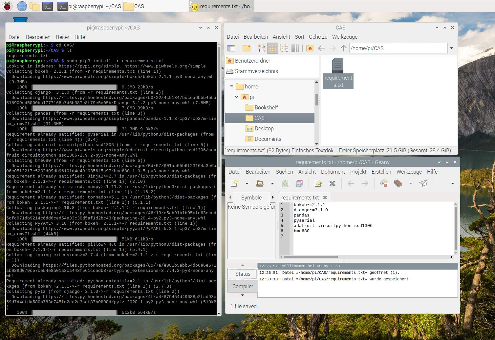

# Setup RaspberryPi 

Erstellt am 12.11.2020 für Raspberry Pi 3 Model B+.

Ziel ist eine Temperaturmessung und die Darstellung der Werte über ein Handy durch "ansurfen" einer Web-Page welche auf den Django-Entwicklungsserver auf dem RaspberryPi läuft.

# Installation
SD-Karte formatieren im FAT32 Format über Windows-Explorer. Wenn SD-Card grösser als 32 GByte, so wird ein zusätzliches Tool benötigt wie z.B. [AOMEI Partition Assistant Standard Edition](https://www.diskpart.com/de/download-home.html) um mit dem erforderliche FAT32 Format formatieren zu können.
Wir schreiben die Installationsdateien auf die SD-Karte mit **Raspberry Pi Imager** von [www.raspberrypi.org](http://www.raspberrypi.org). Wir verwenden nicht NOOBS oder Raspbian. Falls das Imager-Programmfester ausserhalb des Bildschirms ist, kann dieses mit [Alt+Tab] angewählt und mit [Alt+Space] verschoben (Move) werden.

Schreiben der SD-Karte dauert etwas länger....

Es gibt zwei Möglichkeiten den Raspberry Pi (RPI) in Betrieb zu nehmen. Sofern möglich sollte b) verwendet werden!
a) Headless, d.h. ohne Bildschirm und Tastatur.
b) Mit Bildschirm und Tastatur am RPI angeschlossen

### a) Headless
Dieser Teil ist nur relevant wenn kein Bildschirm und keine Tastatur angeschlossen sind, weil wir dann über Fernzugriff den Raspberry (RPI) bedienen werden um die Installation durchführen zu können. Hierzu müssen wir auf die Konsole des RPIs zugreifen. Dies wird über **ssh"**, d.h. Secure Shell durchgeführt. Auf unserem Rechner/Notebook starten wir  die Windowskonsole (oder anderes ssh-Programme wie putty) und  stellen eine sichere Verbindung zu RPI her und können dann auf unserem Rechner/Notbook Kommandos eingeben welche dirket auf dem RPI ausführt werden.
Zuerst müssen wir auf dem RPI einen ssh-Zugriff freigeben. Die teilen wir dem RPI mit, indem wir eine leere Datei mit dem Namen "ssh" auf der SD-Karte speichern. Später beim Starten des RPI erkennt der RPI über die Datei, dass der ssh-Zugriff aktiviert werden soll (nach freischalten löscht der RPI die Datei). 

??
Das Anlegen der ssh-Datei machen wir über die Windows-Konsole. Wir wechseln auf die SD-Karte (falls SD-Karte nicht im Dateimanager angezeigt wird, nochmals neu einstecken) und erzeugen eine leere Date durch:

```
NUL >> ssh
```

Als nächstes definieren wir den WLAN-Zugriff des RPIs. Wir erzeugen mit unserem Notebook ein "Mobile hotspot" (unter Settings > Network & Internet).Wir definieren ein "Network name" und ein "Network password", sowie die WLAN-Frequenz mit 2.4 GHz:


Diese Konfiguration teilen wir dem RPI mit indem wir eine Konfigurationsdatei auf der SD-Karte erstellen. Wir benötigen Notepad++ als Editor und erstellen eine Datei mit dem Inhalt:

    ctrl_interface=DIR=/var/run/wpa_supplicant GROUP=netdev 
    update_config=1
    country=CH
    
    network={
        ssid="setupRPI"
        psk="setupRPI"
    }


Mit dieser Datei definieren wir den WLAN-Zugriff über den "Networkb name" (ssid) und das "Network password"(psk). Diese Datei speichern mit dem Name **"wpa_supplicant.conf"** auf der SD-Card. **Wichtig** unter "Edit" bei "EOL Conversion"als "UNIX (LF) Format" abspeichern.

Das Windows Betriebssystem verwendet für End of Line (EOL) zwei Zeichen (CR=Carrier Return und LF=Line feed). Der RasperryPi arbeitet mit Linux/Unix/OSX und dieses Betriebssystem verwendet als EOL nur ein Zeichen (LF=Line feed). 

Wir stecken die SD-Karte in den RPI und starten diesen. Unter "Mobile hotspot" meldet sich unserer RPI mit einer IP-Adresse an. Mit dieser IP-Adresse verbinden wir und über ssh. Die ssh-Verbindung stellen wir über die Windows-Konsole her. 

```
ssh pi@192.168.137.207
```

Den Username haben wir mit "pi" angegeben. Die IP-Adresse passen wir an. Das Standard-Passwort des RPI lautet "raspberry".


Nun aktivieren wir den VNC-Zugriff, sodass wir mit unserem Rechner/Notebook auf den Desktop des RPI zugreifen können. Hierfür geben wir auf der ssh-Konsole folgendes ein:

```
sudo raspi-config
```

Wir wählen die Interface-Optionen und aktivieren die VNC-Verbindung. 


Nun laden wir den **"real VNC Viewer"** (nicht VNC Server) aus dem Internet und installieren diesen. Wir verbinden uns zum RPI über die IP-Adresse und sind auf dem Desktop des RPI. Wir folgen den Installationsanweisungen. Nicht das WLAN wechseln, sonst verlieren wir die VNC-Remote-Verbindung. **Wichtig** kein Update! Dies machen wir später.

### b) Mit Bildschirm und Tastatur

Wir stecken die SD-Karte in den RPI und starten diesen. Wir folgen den Installationsanweisungen. Wichtig kein Update! Dies machen wir später. Wir öffnen die Konsole auf dem RPI um die IP-Adresse des RPI's herauszufinden. Dies geht mit folgendem Kommando:

```
ifconfig
```

Nun gehen wir zum Rechner/Notebook und laden den "real VNC Viewer" aus dem Internet und installieren diesen auf dem Rechner/Notebook. Wir verbinden uns vom Rechner/Notebook zum RPI über die IP-Adresse des RPI und sind mit dem Rechner/Notebook auf dem Desktop des RPI. Ab nun können wir **remote** auf dem RPI arbeiten, ohne Bildschirm und Tastatur am RPI.

Anschliessend fahren wir fort nach der Beschreibung unten in diesem Dokument "Weitere Einstellungen".

### 

## Weitere Einstellungen

Wir nehmen folgende Einstellungen vor über das Menü **Einstellungen>Raspberry-Pi-Konfiguration>Schnittstellen**:

 - Auflösung festlegen, sodass diese auch über Remote eingestellt wird, z.B. DMT 1920x1200 60Hz.  

 - aktivieren SSH, für den Datei-Zugriff mit SFTP 

 - aktivieren VNC, für Remote-Desktop-Zugriff (bereits aktiv)

 - aktivieren I2C und SPI (für PIOLED und BME680-Sensor)

 - aktivieren Serial Port (für Modbus-Kommunikation mit RS485)

 - DEaktivieren Serial Console

Anschliessend Fenster schliessen. Es erfolgt eine Abfrage zum Neustart, welche wir bestätigen. 

**Hinweis zu Raspberry Pi 4** (nicht RPI 3B+): Auflösung bei nicht angeschlossenem Monitor (headless) über VNC kann nicht mehr im Menü eingestellt werden. Dies muss in der /boot/config.txt Datei erfolgen mittels:

```
hdmi_force_hotplug=1 
hdmi_group=2
hdmi_mode=0x45 
```

siehe: https://www.raspberrypi.org/forums/viewtopic.php?f=28&t=5851

### Zusätzliche Software Pakete installieren

Zuerst finden wir uns auf dem Desktop des RPI zurecht. Wir öffnen den Dateimanager und legen einen Ordner **energieDigital** für uns an. Dort legen wir eine neue Datei **requirements.txt** an um Bibliotheken zu installieren. Wir können als Texteditor "geany" verwenden, welcher bereits auf den RPI installierst ist:

```
bokeh~=2.1.1 
django~=3.1.0
pandas
adafruit-circuitpython-ssd1306
bme680
```

Für die Python-Bibliotheken verwenden wir den Python-Package-Installer "pip3" für Python3. 

```
sudo pip3 install -r requirements.txt
```

Wir arbeiten mit Python 3.x. Um Bibliotheken hierfür zu installieren muss darauf geachtet werden das die "3"-Version verwendet wird. Z.B. **pip3 anstatt pip**. Ohne "3" wird die Version für Python 2.x verwendet. **Der Raspberry benötigt für das System beide Versionen!** Standardmässig wird Python2.x verwendet. Erkennbar durch "python --version", oder man startet auf der Konsole "python" und führt die Division 3/2 durch. Python2.x liefert 1. Wird auf der Konsole "python3" gestartet ergibt 3/2 = 1.5.



# Autostart Display

Der Schreck von der Headless-Inbetriebnahme sitzt noch in den Knochen. Für einen zukünftigen Remote-Zugriff müssen wir die IP-Adresse kennen und diesen wollen wir mit dem Display PIOLED anzeigen. Bei Interesse findest du ergänzende Informationen zum PIOLED [hier](https://learn.adafruit.com/adafruit-pioled-128x32-mini-oled-for-raspberry-pi). Für den Start des Displays sind drei Dateien zu erstellen:

a) autostartRPI.desktop: Diese Datei wird beim Start ausgeführt und öffnet ein "LX Terminal"-Fenster, das ist die RPI-Konsole, sodass du später im Betrieb auf dem Desktop die Konsole mit dem Python-Programm siehst. In der Konsole wird die nächste Datei aufgerufen...

b) startRPI: Diese Linux-Datei startet das Python-Skript

c) start.py: In dieser Datei schreiben wir unseren Python-Code

### a) autostartRPI.desktop

Erstelle eine Datei **`autostartRPI.desktop`** im neu zu erstellenden Ordner **`/home/pi/.config/autostart`**. Hierfür muss beim "Dateimanager>Ansicht>Versteckte anzeigen" aktiviert werden. Inhalt der Datei:

```
[Desktop Entry]
Encoding=UTF-8
Name=autostartRPI
Exec=lxterminal -e "sh /home/pi/energieDigital/startRPI"
Icon=lxterminal
Type=Application
Categories=Utility;
```

lxterminal ist die RPI-Konsole, "-e" bedeutet execute und "sh" heisst die Skriptdatei "startRPI" ausführen. Für diese Datei müssen wir noch die Rechte setzten durch markieren der Datei im Dateimanager, dann rechte Maustaste>Dateieigenschaften>Berechtigung. Wir setzen alles auf "Jeder":


### b) startRPI

Wir erstellen die Skriptdatei **startRPI**, (ohne Endung) im Ordner **energieDigital**. Diese funktioniert wie eine *.bat-Datei unter Windows. In der Datei ist der Befehl "cd...." welcher in unser Verzeichnis wechselt (sicher ist sicher) und anschliessend wird python3 gestartet mit unserem Python-Skript "start.py", welches wir nachfolgend erstellen.

```
#! /bin/sh
cd /home/pi/energieDigital
python3 start.py
```

Auch hier müssen die Rechte auf **Jeder** gesetzt werden. Dateimanager>Datei markieren und rechte Maustaste.


### c) start.py

In dieser Datei können wir nun alle Funktionen einbauen, welche wir uns wünschen. Zuerst die Anzeige der IP-Adresse auf dem Display. Als Pythoneditor verwenden wir Entwicklung>mu oder Entwicklung>Thonny Python IDE.

```python
# -*- coding: utf-8 -*

"""
Python-Code welcher bei Start ausgeführt wird 

@author: markus markstaler
"""

import datetime as dt
import time
import busio
from PIL import Image, ImageDraw, ImageFont
import adafruit_ssd1306
import subprocess

# Initalize Display
i2c = busio.I2C(3, 2)   # Create the I2C with SCL = 3, SDA = 2.
disp = adafruit_ssd1306.SSD1306_I2C(128, 32, i2c)   # Create class
image = Image.new('1', (128, 32))   # Create blank image for drawing.
draw = ImageDraw.Draw(image)   # Get drawing object to draw on image
font = ImageFont.load_default()   # Load default font.


while True:  
    zeit = dt.datetime.now().strftime('%Y-%m-%d %H:%M:%S')
    ipAll = subprocess.check_output('hostname -I', shell=True).decode('utf-8')
    ip = ipAll[0:ipAll.find(' ')] # nimmt den ersten Teil (IP4) der Adresse

    # Display
    draw.rectangle((0, 0, 128, 32), outline=0, fill=0)   # Draw box to clear image
    draw.text((0, -2+0), 'IP: %s' %ip, font=font, fill=255)
    draw.text((0, -2+8),  zeit, font=font, fill=255)
    draw.text((0, -2+16), '', font=font, fill=255)
    draw.text((0, -2+25), 'es funktioniert !', font=font, fill=255)
    disp.image(image)
    disp.show()

    print(ip)
    print(zeit)
    time.sleep(5)
```

*Geschafft!* Nun können wir das WLAN wechseln und sehen die IP-Adresse auf dem Display. Mit folgenden beiden Kommandos kann die Paketliste aktualisiert werden und anschliessend die Pakete installiert werden:

```
sudo apt update
sudo apt full-upgrade
```

# BME 680 Sensor

Wir verwenden den Multisensor BME680 von Bosch, welcher Temperatur, relative Luftfeuchtigkeit, Luftdruck und VOC misst. VOC steht für volatile organic compounds, d.h. flüchtige organische Verbindungen oder kohlenstoffhaltige Dämpfe. Beispiel hierfür sind Lösungsmittel, Ausgasung bei Kunststoffen oder Alkohole. Informationen zum Sensor sind [hier](https://learn.pimoroni.com/tutorial/sandyj/getting-started-with-bme680-breakout). Wir lesen die Messwerte digital aus, über den I2C-Bus. Am I2C-Bus haben wir bereits das PIOLED-Display angeschlossen . Wir könnten den BME dazu hängen, d.h. allerdings wir müssten Löten. Wir definieren deshalb eine zweite I2C-Schnittstelle. Die Stiftleistung beim RPI ist durchnummeriert mit Pin 1 bis Pin 40. Einige Pins sind mit GPIO bezeichnet für General Purpose In- Output. Diese können für verschiedene Funktionen verwendet werden. Hier definieren wir die zweite I2C-Schnittstelle.


Für I2C ist eine Datenleitung (SDA=Serial Data) und eine Clock-Leitung (SCL=Serial Clock) notwendig. Hinzu kommt die Sensor-Versorgung mit 3.3V und Ground.

|      | PIOLED         | BME680                   |
| ---- | -------------- | ------------------------ |
| 3V3  | Pin 1          | Pin 17   (rot)           |
| SDA  | Pin 3 - GPIO 2 | Pin 16 - GPIO 23  (gelb) |
| SLC  | Pin 5 - GPIO 3 | Pin 18 - GPIO 24  (grau) |
| GND  | Pin 6          | Pin 20   (schwarz)       |

Wir müssen dem Betriebssystem des RPI mitteilen, dass wir eine zweite I2C-Schnittstelle betreiben möchten. Dies erfolgt in der Datei **/boot/config.txt**. Hierfür müssen wir den Editor mit root-Rechte öffnen, sodass wir Änderungen abspeichern dürfen. Hierfür geben wir folgendes auf der RPI-Konsole ein:

```
sudo geany 
```

Wir öffnen die Datei **/boot/config.txt** und ergänzen folgende Zeile. Achtung KEIN Leerzeichen nach dem Komma.

```
dtoverlay=i2c-gpio,bus=2,i2c_gpio_delay_us=1,i2c_gpio_sda=23,i2c_gpio_scl=24
```

"bus=2" heisst eine zweite I2C-Schnittstelle auf GPIO 23 für SDA und GPIO 24 für SCL definiert wird. Die erste I2C-Schnittstelle ist bereits vorgegeben. Die Eintrag sieht wie folgt aus:


Die Änderungen werden erst nach dem nächsten Start übernommen, d.h. RPI Neustarten:

```
sudo reboot
```

Aus den Code-Beispielen zum BME680-Breakout habe ich folgende Code-Blöcke für die Initialisierung des Sensors und die Messung entnommen:

```python
# -*- coding: utf-8 -*
"""
Lesen Sensordaten BME680
"""
import datetime as dt
import time
import bme680 # sudo pip3 install bme680
import smbus


""" Initialisierung BME680
 i2c auf Standardkonfiguration: SMBus(1) SDA=GPIO2=Pin3 und SCL=GPIO3=Pin5
 i2c auf SMBus(2) SDA=GPIO23=Pin16 und SCL=GPIO24=Pin18. Muss beim Rasperry Pi konfiguriert werden unter /boot/config.txt:
 dtoverlay=i2c-gpio,bus=2,i2c_gpio_delay_us=1,i2c_gpio_sda=23,i2c_gpio_scl=24
"""
smbus2 = smbus.SMBus(2)
sensor = bme680.BME680(bme680.I2C_ADDR_PRIMARY, smbus2)
sensor.set_humidity_oversample(bme680.OS_2X)
sensor.set_pressure_oversample(bme680.OS_4X)
sensor.set_temperature_oversample(bme680.OS_8X)
sensor.set_filter(bme680.FILTER_SIZE_3)
sensor.set_gas_status(bme680.ENABLE_GAS_MEAS)
sensor.set_gas_heater_temperature(320)
sensor.set_gas_heater_duration(150)
sensor.select_gas_heater_profile(0)


while True:  

    # Sensor    
    sensor.get_sensor_data() # Anweisung Sensor soll messen
    temp = sensor.data.temperature
    humi = sensor.data.humidity
    prea = sensor.data.pressure
    vocR = sensor.data.gas_resistance/10000  # 10kOhm    
    zeit = dt.datetime.now().strftime('%Y-%m-%d %H:%M:%S')

  
    print('%s | %3.1f °C | %3.1f %% | %3.1f hPa | %3.1f voc'%(zeit, temp, humi, prea, vocR))
    time.sleep(5)
```

Wir sehen das beim BME680 eine I2C-Schnittstelle über smbus-Bibliothek angelegt wird. Beim PIOLED wurde dies über die busio-Bibliothek durchgeführt. Es gibt verschiedene Wege zur Lösung und wir verwenden den Code aus den Beispielen vom BME und PIOLED.

# Start Django-Webpage

