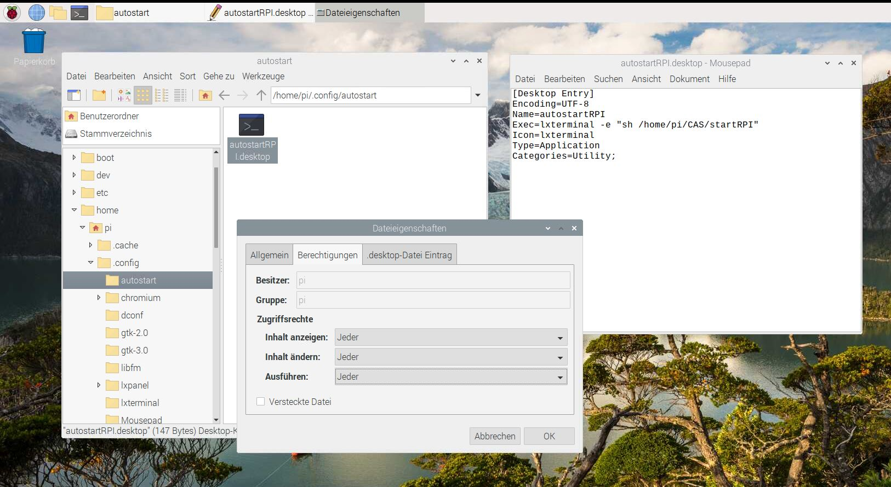

# Setup RaspberryPi 

Erstellt am 15.12.2021 für Raspberry Pi 3 Model B+ für den Unterricht im **CAS Energie digital**.

Ziel ist mit dem RaspberryPi eine Luftmessstation zu bauen. Die Messwerte für Temperatur, Feuchte, Luftdruck werden über ein Handy durch "ansurfen" einer Web-Page dargestellt. Die Webpage läuft über den Django-Entwicklungsserver auf dem RaspberryPi. Inhalt des Tutorials:

- Installation Raspberry Pi (RPI) mit den notwendigen Python-Pakete
- Ansteuerung Mini-Display PIOLED
- Auslesen des Multisensor
- Abspeichern der Messdaten in eine csv-Datei und/oder einer SQLite-Datenbank
- Erstellen einer einfachen Webpage zur Darstellung der Messdaten als Diagramm
- Automatisches Starten der Messung und des Entwicklungsserver für die Webpage beim Einschalten des Raspberry Pi's.

# Installation
Wir schreiben die Installationsdateien auf die SD-Karte mit **Raspberry Pi Imager** von [www.raspberrypi.org](http://www.raspberrypi.org). Wir verwenden nicht NOOBS oder Raspbian. Falls das Imager-Programmfester ausserhalb des Bildschirms ist, kann dieses mit [Alt+Tab] angewählt und mit [Alt+Space] verschoben (Move) werden.

**Wichtig!** Im November 2021 erfolgte die neue OS-Version "Debian Bullseye", welche derzeit noch für uns relevante Bugs hat (VNC-Auflösung, 2nd I2C-Port, owncloud), d.h. installiere **Raspberry Pi OS (other) > Raspberry Pi OS (Legacy)** basierden dem "Debian Buster".

Das Schreiben der SD-Karte dauert etwas länger....

Es gibt zwei Möglichkeiten den Raspberry Pi (RPI) in Betrieb zu nehmen. Sofern möglich sollte b) verwendet werden!
a) Headless, d.h. ohne Bildschirm und Tastatur.
b) Mit Bildschirm und Tastatur am RPI angeschlossen

### a) Headless
Dieser Teil ist nur relevant, wenn kein Bildschirm und keine Tastatur angeschlossen sind, weil wir dann über Fernzugriff den Raspberry (RPI) bedienen werden um die Installation durchführen zu können. Hierzu müssen wir auf das Terminal des RPIs zugreifen. Dies wird über **"ssh"**, d.h. Secure Shell durchgeführt. Shell ist ein Begriff für das Terminal . Wir werden auf  dem Notebook das Windows-Terminal (oder ein anderes ssh-Programm wie putty) starten und eine sichere Verbindung zum RPI herstellen und können dann auf dem Notebook Kommandos eingeben welche direkt auf dem RPI ausführt werden.

Zuerst müssen wir auf dem RPI den ssh-Zugriff freigeben. Dies teilen wir dem RPI mit, indem wir eine leere Datei mit dem Namen "ssh" auf der SD-Karte speichern. Später beim Starten, erkennt der RPI über die Datei, dass der ssh-Zugriff aktiviert werden soll (nach dem Freischalten löscht der RPI die Datei). 
Das Anlegen der ssh-Datei machen wir über das Windows-Terminal. Wir wechseln auf die SD-Karte (falls SD-Karte nicht im Dateimanager angezeigt wird, nochmals neu einstecken) und erzeugen eine leere Datei durch:

```
NUL >> ssh
```

Als nächstes definieren wir den WLAN-Zugriff des RPIs. Wir erzeugen mit unserem Notebook ein "Mobile hotspot" (unter Settings > Network & Internet). Wir definieren ein eigenen "Network name" und ein "Network password", sowie die WLAN-Frequenz mit 2.4 GHz (sofern möglich). Verwendet einen eigenen Netzwerkname und nicht "setupRPI", sodass wir uns untereinander mit dem WLAN nicht stören.


Diese Konfiguration teilen wir dem RPI mit, indem wir eine Konfigurationsdatei auf der SD-Karte erstellen. Wir benötigen Notepad++ als Editor und erstellen eine Datei mit dem Inhalt:

    ctrl_interface=DIR=/var/run/wpa_supplicant GROUP=netdev 
    update_config=1
    country=CH
    
    network={
        ssid="setupRPI"
        psk="setupRPI"
    }


Diese Datei speichern mit dem Name **"wpa_supplicant.conf"** auf der SD-Card. **Wichtig** unter "Edit" bei "EOL Conversion"als "UNIX (LF) Format" abspeichern.

Das Windows Betriebssystem verwendet für End of Line (EOL) zwei Zeichen (CR=Carrier Return und LF=Line feed). Der RasperryPi arbeitet mit Linux/Unix/OSX und dieses Betriebssystem verwendet als EOL nur ein Zeichen (LF=Line feed). 

Wir stecken die SD-Karte in den RPI und starten diesen. Unter "Mobile hotspot" meldet sich unserer RPI mit einer IP-Adresse an. Mit dieser IP-Adresse verbinden wir uns über ssh durch Eingabe auf dem Windows-Terminal: 

```
ssh pi@192.168.137.207
```

Den Username haben wir mit "pi" angegeben. Die IP-Adresse passen wir an. Das Standard-Passwort des RPIs lautet "raspberry".


Nun aktivieren wir den VNC-Zugriff, sodass wir mit unserem Rechner/Notebook auf den Desktop des RPIs zugreifen können. Hierfür geben wir auf dem ssh-Terminal folgendes ein:

```
sudo raspi-config
```

Wir wählen die Interface-Optionen und aktivieren die VNC-Verbindung. 


Nun laden wir den **"real VNC Viewer"** (nicht VNC Server) aus dem Internet und installieren diesen auf unserem Notebook. Wir verbinden uns zum RPI über die IP-Adresse und sind auf dem Desktop des RPIs. Wir folgen den Installationsanweisungen. Nicht das WLAN wechseln, sonst verlieren wir die VNC-Remote-Verbindung. **Wichtig** kein Update! Dies machen wir später. Nun können wir zum Kapitel "Weitere Einstellungen" springen.

### b) Mit Bildschirm und Tastatur

Wir stecken die SD-Karte in den RPI und starten diesen. Wir folgen den Installationsanweisungen. Wichtig kein Update! Dies machen wir später. 

## Ab nun Remote!

Das Grundsystem ist auf dem RPI installiert. Ab nun arbeiten wir Remote, d.h. der RPI hat kein Bildschirm oder Tastatur und Maus. Wir verbinden uns Remote auf den RPI über den **real VNC Viewer"** (nicht VNC Server) welcher über das Internet geladen und anschliessend auf dem Rechner installiert wird. 

Um uns mit der RPI zu Verbinden müssen wir die IP-Adresse des Raspberry Pi kennen. Wir öffnen das Terminal auf dem RPI mit der Tastenkombination **Strg+Alt+T** (oder Links oben aufs Icon klicken) und geben folgenden Befehl ein um die IP-Adresse des wlan0 zu erhalten:

```
ifconfig
```

Mit VNC können auch Dateien übertragen werden, jedoch einfacher geht es mit sFTP-Tool wie **WinSCP** oder **FileZilla**.

## Weitere Einstellungen

Nach a) oder b) nehmen wir folgende Einstellungen vor, über das Menü **Einstellungen>Raspberry-Pi-Konfiguration>Schnittstellen**:

 - Auflösung festlegen, sodass diese auch über Remote (VNC) eingestellt wird, z.B. DMT 1920x1200 60Hz.  

 - aktivieren SSH, für den Datei-Zugriff mit SFTP 

 - aktivieren VNC, für Remote-Desktop-Zugriff

 - aktivieren I2C und SPI (für PIOLED und BME680-Sensor)

 - aktivieren Serial Port (für Modbus-Kommunikation mit RS485)

 - DEaktivieren Serial Console

Anschliessend Fenster schliessen. Es erfolgt eine Abfrage zum Neustart, welche wir bestätigen. 

**Hinweis zu Raspberry Pi 4** (nicht RPI 3B+): Auflösung bei nicht angeschlossenem Monitor (headless) über VNC kann nicht mehr im Menü eingestellt werden. Dies muss in der /boot/config.txt Datei erfolgen mittels:

```
hdmi_force_hotplug=1 
hdmi_group=2
hdmi_mode=0x45 
```

siehe: https://www.raspberrypi.org/forums/viewtopic.php?f=28&t=5851. Für Änderungen muss der Editor mit Admin-Rechte gestartet werden durch `sudo geany`.

### Zusätzliche Software Pakete installieren

Zuerst finden wir uns auf dem Desktop des RPIs zurecht. Wir öffnen den Dateimanager und legen einen Ordner `CAS` für uns an unter `/home/pi`. Dort legen wir eine neue Datei **requirements.txt** an um Bibliotheken zu installieren. Wir können als Texteditor "geany" verwenden, welcher bereits auf den RPI installierst ist:

```
matplotlib
pandas
django
pysqlite3
adafruit-circuitpython-ssd1306
pimoroni-bme280
pimoroni-sgp30
smbus2
```

Für die Python-Bibliotheken verwenden wir den Python-Package-Installer "pip3" für Python3. Mit "-r" teilen wir dem Python-Package-Installer mit, dass die Pakete in der Textdatei "requirement.txt" angegeben sind. Hierfür bewegen wir und mit dem Terminal in den Ordner `CAS`  mit den Kommando "cd". Anstatt "dir" gilt bei UNIX "ls" für list. Autocomplete bei Dateinamen mit Tabulator funktioniert ebenfalls.

Unix oder Linux ist ein sicheres Betriebssystem, u.a. dadurch das die Ausführungsrechte eingeschränkt sind. Um ein Programm oder eine Datei mit Administratorrechte ausführen zu können wir "sudo" vor dem Befehl gestellt. 

```
sudo pip3 install -r requirements.txt
```

Wir arbeiten mit Python 3.x. Um Bibliotheken hierfür zu installieren muss darauf geachtet werden das die "3"-Version verwendet wird. Z.B. **pip3 anstatt pip**. Ohne "3" wird die Version für Python 2.x verwendet. **Der RaspberryPi benötigt für das System beide Versionen!** Standardmässig wird Python2.x verwendet. Erkennbar durch "python --version", oder "python3 --version".

# PIOLED Display

Der Schreck von der Headless-Inbetriebnahme sitzt noch in den Knochen. Für einen zukünftigen Remote-Zugriff müssen wir die IP-Adresse kennen und diese wollen wir mit dem aufsteckbaren Display PIOLED anzeigen. Somit können wir später den RPI einschalten und dieser verbindet sich mit dem WLAN und stellt die IP-Adresse dar, sodass wir einen Remote-Zugriff durchführen können. Bei Interesse findest du ergänzende Informationen zum PIOLED [hier](https://learn.adafruit.com/adafruit-pioled-128x32-mini-oled-for-raspberry-pi/usage). 

Wir erstellen ein Python-Skrip namens **start.py**. Auf dem RPI ist bereits ein Pythoneditor installiert unter "Entwicklung>Thonny Python IDE". Wir Initialisieren das Display und stellen die ip-Adresse dar, sowie die Uhrzeit.

```python
# -*- coding: utf-8 -*
"""
Python-Code welcher bei Start ausgeführt wird 
@author: markus markstaler
"""
import datetime as dt
import time
import busio
from PIL import Image, ImageDraw, ImageFont
import adafruit_ssd1306
import subprocess
import socket

# Initalize Display
i2c = busio.I2C(3, 2)   # Create the I2C with SCL = 3, SDA = 2.
disp = adafruit_ssd1306.SSD1306_I2C(128, 32, i2c)   # Create class
image = Image.new('1', (128, 32))   # Create blank image for drawing.
draw = ImageDraw.Draw(image)   # Get drawing object to draw on image
font = ImageFont.load_default()   # Load default font.

while True:  
    zeit = dt.datetime.now().strftime('%Y-%m-%d %H:%M:%S')
    # Ermittelt IP-Adresse
    s = socket.socket(socket.AF_INET, socket.SOCK_DGRAM) # erstellt Netzwerkverbindung
	s.connect(('1.1.1.1',1)) # fiktiver Internetzugriff
	ip = s.getsockname()[0] # ermittelt IP-Adresse
    
    # Display
    draw.rectangle((0, 0, 128, 32), outline=0, fill=0)   # Draw box to clear image
    draw.text((0, -2+0), 'IP: %s' %ip, font=font, fill=255)
    draw.text((0, -2+8),  zeit, font=font, fill=255)
    draw.text((0, -2+16), '', font=font, fill=255)
    draw.text((0, -2+25), 'es funktioniert !', font=font, fill=255)
    disp.image(image)
    disp.show()

    print(ip)
    print(zeit)
    time.sleep(5)
```

# Autostart

Nun soll das Python-Skript **start.py** automatisch gestartet werden wenn der RPI eingeschalten wird. Es gibt unterschiedliche Wege um ein Autostart beim RPI zu implementieren. Wir wollen dass, das Python-Programm (start.py) gestartet wird und die gemessenen Werte in dem RPI-Terminal dargestellt werden, deshalb muss zuerst das Betriebssystem des RPI mit der Bedienoberfläche "Desktop" gestartet werden, anschliessend soll das RPI-Terminalfenster geöffnet werden und schlussendlich die start.py gestartet werden. Hierfür sind zwei Linux-Dateien notwendig:

a) autostartRPI.desktop: Diese Datei wird beim Start ausgeführt und öffnet ein "LX Terminal"-Fenster, das ist das RPI-Terminal, sodass du später im Betrieb auf dem Desktop das Terminalfenster mit dem Python-Programm siehst. Im Terminal wird die nächste Datei aufgerufen...

b) startRPI: Diese Linux-Datei startet das Python-Skript

Nun im Detail.

### a) autostartRPI.desktop

Erstelle eine Datei **`autostartRPI.desktop`** im neu zu erstellendem Ordner **`/home/pi/.config/autostart`**. Hierfür muss beim "Dateimanager>Ansicht>Versteckte anzeigen" aktiviert werden. Inhalt der Datei **autostartRPI.desktop**:

```
[Desktop Entry]
Encoding=UTF-8
Name=autostartRPI
Exec=lxterminal -e "sh /home/pi/CAS/startRPI"
Icon=lxterminal
Type=Application
Categories=Utility;
```

lxterminal ist das RPI-Terminal, "-e" bedeutet execute und "sh" heisst die Skriptdatei "startRPI" ausführen. Für diese Datei müssen wir noch die Rechte setzten durch markieren der Datei im Dateimanager, dann rechte Maustaste>Dateieigenschaften>Berechtigung. Wir setzen alles auf "Jeder":



Wir sehen wie das Betriebssystem Linux funktioniert. Für alles gibt es eine Datei, welche angibt was passieren soll und Linux ist auch über Ordner organisiert wie am Beispiel "autostart" zu sehen ist. Nach dem Booten und dem Aufstarten des Desktop wird durch den Ordner "autostart" dem Betriebssystem mitgeteilt das ein Programm (das Terminal) gestartet werden soll.

### b) startRPI

Wir erstellen die Shelldatei **startRPI** (ohne Endung) im Ordner **CAS** (muss neu angelegt werden). Diese funktioniert wie eine *.bat-Datei unter Windows. In der Datei ist der Befehl "cd...." welcher in unser Verzeichnis wechselt (sicher ist sicher) und anschliessend wird python3 gestartet mit unserem Python-Skript "start.py", welches wir vorhin erstellt haben.

```
#! /bin/sh
cd /home/pi/CAS
python3 start.py
```

Auch hier müssen die Rechte auf **Jeder** gesetzt werden. Dateimanager>Datei markieren und rechte Maustaste.


# Multisensor

Wir verwenden den Multisensor BME280 von Bosch. Wir lesen die Messwerte digital aus, über den I2C-Bus. Am I2C-Bus haben wir bereits das PIOLED-Display angeschlossen. Wir könnten die Sensoren dazu hängen, d.h. allerdings müssten wir Löten. Wir definieren deshalb eine zweite I2C-Schnittstelle. Die Stiftleiste beim RPI ist durchnummeriert mit Pin 1 bis Pin 40. Einige Pins sind mit GPIO bezeichnet für General Purpose Input Output. Diese können für verschiedene Funktionen verwendet werden. Hier definieren wir die zweite I2C-Schnittstelle.


Für I2C ist eine Datenleitung (SDA=Serial Data) und eine Clock-Leitung (SCL=Serial Clock) notwendig. Hinzu kommt die Sensor-Versorgung mit 3.3V und Ground.

|      | PIOLED         | I2C-Multisensoren        |
| ---- | -------------- | ------------------------ |
| 3V3  | Pin 1          | Pin 17   (rot)           |
| SDA  | Pin 3 - GPIO 2 | Pin 16 - GPIO 23  (gelb) |
| SLC  | Pin 5 - GPIO 3 | Pin 18 - GPIO 24  (grau) |
| GND  | Pin 6          | Pin 20   (schwarz)       |

Wir müssen dem Betriebssystem des RPIs mitteilen, dass wir eine zweite I2C-Schnittstelle betreiben möchten. Dies erfolgt in der Datei **/boot/config.txt**. Der Editor wird mit root-Rechte geöffnet, sodass die Änderungen abspeichert werden können. Befehl auf dem RPI-Terminal zum Öffnen des Editors mit Admin-Rechte:

```
sudo geany 
```

Im Editor Geany unter "öffnen" navigieren wir zur Datei **/boot/config.txt** und öffnen diese und ergänzen folgende Zeile. Achtung KEIN Leerzeichen nach dem Kommas.

```
dtoverlay=i2c-gpio,bus=2,i2c_gpio_delay_us=1,i2c_gpio_sda=23,i2c_gpio_scl=24
```

"bus=2" heisst eine zweite I2C-Schnittstelle auf GPIO 23 für SDA und GPIO 24 für SCL. Die erste I2C-Schnittstelle ist bereits vorgegeben. Der Eintrag sieht wie folgt aus:


Die Änderungen werden erst **nach dem nächsten Start** übernommen, d.h. RPI Neustarten:

```
sudo reboot
```

Abschliessend sehen wir nach ob die I2C-Schnittstelle den angeschlossenen Sensor findet indem wir die Adressen (als hex) abfragen. "-y" sodass nicht mit "yes" bestätigt werden muss und "2" für die zweite I2C-Schnittstelle.

```
sudo i2cdetect -y 2
```

Aus den Code-Beispielen zu den Multisensoren habe ich folgende Code-Blöcke für die Messung entnommen. Dieser Code können wir im Python-Skript **start.py** ergänzen (oder ein neues Python-Skript erstellen):

```python
import time
import smbus2
import bme280

# Initialise
bus = smbus2.SMBus(2)
bme280 = bme280.BME280(i2c_dev=bus)

while True:
    temperature = bme280.get_temperature()
    pressure = bme280.get_pressure()
    humidity = bme280.get_humidity()
    print('{:5.1f}°C {:5.0f}hPa {:5.0f}%'.format(temperature, pressure, humidity))
    time.sleep(1)
```

Wir sehen dass, bei den Sensoren eine I2C-Schnittstelle über smbus2-Bibliothek angelegt wird. Beim PIOLED wurde dies über die busio-Bibliothek durchgeführt. Es gibt verschiedene Wege zur Lösung und wir verwenden den Code aus den Hersteller-Beispielen der Sensoren.

# Messdaten speichern

Daten können, direkt lesbar in einer Textdatei gespeichert werden, oder in einer Datenbank.

## Textdatei

Die gemessenen Sensordaten werden in einer Textdatei im  csv-Format gespeichert (csv = Comma Separated Values). Aus der Zeit und den Messwerten wird ein Text-String erzeugt, dabei legen wir das Format fest, sodass nur 2 Nachkommastellen abgespeichert werden. Im Text-String erfolgt die Formatierung innerhalb der geschweiften Klammern. Die Werte werden mit der Funktion .format() übergeben.


Anschliessend wird die csv-Datei mit der Python Build-In Funktion open erstellt/geöffnet. Hier wird der Dateiname angegeben. Python sucht im Ordner, wo die Python-Skript-Datei abgelegt ist. Ist die Datei noch nicht angelegt, so wird eine neue Datei erzeugt. Mit dem Schalter "a+", wird angegeben dass Daten angehängt werden,  "a" für append, "+" für updating (reading and writing). Am Ende muss die Datei geschlossen werden. 

```python
text = '{0:s}, {1:0.2f}, {2:0.2f}, {3:0.2f}\n'.format(zeit, temp, humi, prea)
f = open('messdaten.csv','a+')
f.write(text)
f.close()
```

CSV ist eine schnelle und Speicherplatz sparende Art Daten zu speichern. Nachteil ist, dass nicht zur selben Zeit Daten geschrieben (=gespeichert) und gelesen werden können. Hierbei kann die Datei unlesbar gemacht werden und die Messdaten wären dann verloren. Eine Lösung hierfür ist eine Datenbank.

## Datenbank

Wir verwenden SQLite als Datenbank. Dies ist eine Single File Database mit dem Vorteil das bei einem Backup nur eine Datei gespeichert werden muss. Die Datenbank ermöglicht komplexe Datenbankabfragen über SQL (Structured Query Language). Wir werden die Datenbearbeitung/Analyse in Python durchführen, nicht mit SQL! Demzufolge laden wir die gesamten Daten mit dem Befehl SELECT. Das Schreiben der Daten in die Datenbank erfolgt mit INSERT. Zuvor wird die Datenbank-Tabelle mit CREATE angelegt. Das sind alle drei relevanten SQL-Befehle.

Wir prüfen ob die Datenbankdatei vorhanden ist, wenn nicht, wird die Datenbank erzeugt. Für die einzelnen Spalten wird das Format definiert (Formatdefinitionen siehe im Internet unter "sqlite create table", speziell der Parameter UNIQUE).

```python
import sqlite3 # pip3 install pysqlite3

filename = 'messdaten.sqlite3'
if not(os.path.isfile(filename)):
    sql = '''CREATE TABLE tabelle (
    	zeit DATETIME UNIQUE,
    	temp REAL,
    	humi REAL,
    	prea REAL)'''
    db = sqlite3.connect(filename)
    cur = db.cursor()
    cur.execute(sql)
    db.commit()
    cur.close()
    db.close()
```

Schreiben der Messdaten in die Datenbank:

```python
zeit = dt.datetime.now().strftime('%Y-%m-%d %H:%M:%S')
sql = '''INSERT INTO tabelle (zeit, temp, humi, prea) VALUES (
    strftime("%Y-%m-%d %H:%M:%f", "{0:s}"),
    {1:0.2f},
    {2:0.2f},
    {3:0.2f}'''.format(zeit, temp, humi, prea)
db = sqlite3.connect(filename)
cur = db.cursor()
cur.execute(sql)
db.commit()
cur.close()
db.close() 
```

Um die Daten in der Datenbank anzusehen eignet sich das Tool **SQLiteBrowser**, zu finden im Internet. Das Auslesen der Daten aus der Datenbank erfolgt über pandas. Die Daten stehen dann als Dataframe zur Verfügung.

```python
zeit = dt.datetime.now() - dt.timedelta(days=3) # Daten der letzten 3 Tage
zeit = zeit.strftime('%Y-%m-%d')
db = sqlite3.connect(filename)
df = pd.read_sql_query('SELECT * FROM tabelle WHERE zeit>strftime("%Y-%m-%d","{0:s}")'.format(zeit), db)
db.close() 
```

# Lokale Webpage

Nun werden die Daten als Django-Webpage dargestellt über den lokalen Entwicklungsserver welcher auf dem RPI läuft. Erstellen einer Webpage mit Django wurde im Tutorial "Visualisierung 1" behandelt. Wir können unserer bestehendes Projekt auf den RPI kopieren. Im Folgenden erzeugen wir ein neues Projekt:

```
django-admin startproject energieDigital .
```

Dann folgen Ergänzungen in den beiden Dateien: 

- **settings.py**:  ergänzen unserer App 'energieDigital' bei INSTALLED_APPS. Wir führen den Pfadname für unsere statischen Dateien hinzu: 
  `STATIC_ROOT = os.path.join(BASE_DIR, 'energieDigital/static/')` 
- **urls.py**: Importieren der noch zu erstellenden Funktion "chart" aus der Datei views.py: ` from . import view` . Weiter soll beim Aufruf der url die importierte Funktion ausgeführt werden. Hierzu ergänzen wir die urlpatterns um `path('', views.chart)`.

Nun legen wir zwei Ordner an. Der Ordner `templates` für die Datei `home.html`und der Ordner `static`indem das Diagramm als jpg-Datei abgespeichert wird.

```
energieDigital 
   ├── static 
   └── templates
```

Nun legen wir noch zwei neue Dateien an.

**views.py**

```python
from django.shortcuts import render
from django.conf import settings
import pandas as pd
import datetime as dt
import sqlite3
import matplotlib.pyplot as plt

def chart(request):    
    zeit = dt.datetime.now() - dt.timedelta(days=3) # Daten der letzten 3 Tage
    zeit = zeit.strftime('%Y-%m-%d')
    db = sqlite3.connect('messdaten.sqlite3')
    df = pd.read_sql_query('SELECT * FROM tabelle WHERE zeit>strftime("%Y-%m-%d","{0:s}")'.format(zeit), db)
    db.close() 
    
    df = df.set_index(df['zeit']) 
    df.plot(subplots=True)
    plt.savefig(settings.STATIC_ROOT +'allCharts.jpg', bbox_inches='tight')
    
    return render(request, 'home.html')
```

**home.html**

Diese Datei liegt im Unterordner `templates`.

```html

<html>
    <head>
        <title>Energie digital</title>    
    </head>
    <body>
        
    </body>
</html>
```

Die Webpage soll über die IP-Adresse des RPIs aufgerufen werden können. Hierfür "erlauben" wir Django diese IP-Adresse. Dies wird in **settings.py** ergänzt:

```python
import socket

# Ermittelt IP-Adresse
s = socket.socket(socket.AF_INET, socket.SOCK_DGRAM) # erstellt Netzwerkverbindung
s.connect(('1.1.1.1',1)) # fiktiver Internetzugriff
ip = s.getsockname()[0] # ermittelt IP-Adresse

ALLOWED_HOSTS = ['127.0.0.1', ip]
```

# Autostart - die Zweite

Nun soll die Webpage automatisch mit dem Hochstarten des RPIs gestartet werden. Wir ergänzen die folgende Datei.

**start.py**

In der bereits erstellten Datei start.py werden die Sensoren ausgelesen. Wenn nicht schon umgesetzt, können hier die Messwerte in die Datenbank geschrieben werden. Die Datei sollte im selben Ordner liegen wie die Datei **messdaten.sqlite3** und die Django-Datei **mange.py**. In der start.py ergänzen wir folgende Zeilen zur Ermittlung der IP-Adresse und das Starten des Django Entwicklungsservers.

```python
import subprocess
import socket

s = socket.socket(socket.AF_INET, socket.SOCK_DGRAM) # erstellt Netzwerkverbindung
s.connect(('1.1.1.1',1)) # fiktiver Internetzugriff
ip = s.getsockname()[0] # ermittelt IP-Adresse
subprocess.Popen(['python3', 'manage.py', 'runserver', ip+':8000']) # startet den Entwicklungsserver
```

# Daten- Fernübertragung übers Internet

Das bisher umgesetzte Konzept ermöglicht das Messen von Daten und Darstellen der Ergebnisse über eine Webpage im eigenem WLAN bzw. Heimnetzwerk. Möchte man die Daten über eine längere Distanz übertragen bietet sich das Internet an, jedoch soll der RPI hinter der Firewall des eigenen Modems betrieben werden, d.h. er verbleibt im Heimnetz aus Sicherheitsgründen. Für eine sichere Datenverbindung übers Internet, verwenden wir eine abgesicherte Cloud-Lösung, somit müssen wir uns keine Gedanken über sichere Internetverbindung machen. Auf dem RPI wird ein Ordner angelegt, welcher über die Cloud synchronisiert wird und so können die Daten vom RPI von einen anderen Rechner verwendet werden.

Als Cloud-Dienst verwenden wir [SwitchDrive](https://www.switch.ch/drive/), die Schweizer Cloud-Lösung der Hochschulangehörigen. Dort ist auch die Installation auf dem Notebook beschrieben. Auf dem RPI erfolgt die Installation durch:

```
sudo apt-get install owncloud-client
```

Nach Installation wird das Programm gestartet:

```
owncloud
```

Hier wird die Serveradresse **https://drive.switch.ch** angegeben und anschliessend führen wir ein Login durch. 


Nun können noch die zu synchronisierenden Ordner ausgewählt werden und der Datentransfer ist erfolgreich umgesetzt!

# Update des RaspberryPi

Wenn nun ausreichend Zeit vorhanden ist, kann das System upgedatet werden. Mit "update" wird die SW-Liste aktualisiert und mit "upgrade" werden die neuen Versionen geladen und installiert:

```
sudo apt-get update
sudo apt-get full-upgrade
```