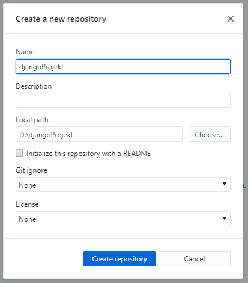

# Visualisierung 1

Um entscheiden oder handeln zu können sind Informationen notwendig. Z.B. Energiemonitoring um die Effizienz zu beurteilen oder ein Niederschlagradar um eine geeignete Tourenwahl zu treffen. Werden Berechnungen oder Modellierungen ausgeführt so helfen diese Informationen ebenfalls um Entscheidungen zu fällen. Im Ingenieurwesen sind Informationen in der Regel als ein Diagramm dargestellt. In den beiden Tutorial auf [pv4ing.ch](https://pv4ing.ch) wurden die für uns relevanten Diagramme vorgestellt. Zusätzlich sollte bei einer Visualisierung noch ein erklärender Text hinzu, nicht zu viel aber ein bisschen macht Sinn.

Denken wir an Energiemonitoring, so sollte die Visualisierung günstig sein, d.h. kein zusätzlicher Bildschirm und PC um den Zählerstand darzustellen. Das günstigste Display ist dies, welches wir bereits dabei haben, das Mobil oder ein PC.

Deshalb bauen wir nicht ein eigenes GUI (Graphical User Interface), sondern erstellen eine Webpage. Auf der Messeinheit läuft ein Server, welcher die Information als Webpage darstellt. Mit dem Mobil oder dem PC wird dieser Server "angesurft", welcher die Informationen als Webpage über einen Browser darstellt.

Dabei ist neben der eigentlichen Information, die Darstellung der Webpage wichtig um eine gute Lesbarkeit auf unterschiedlichen Endgeräten (PC, Notebook, Smartphone) zu erreichen. Dies wird als Responsiv Design bezeichnet.


### Leistsatz

Das Bauen einer Website kann zu einer sehr aufwändigen Sache werden, vor allem wenn wir uns in der Gestaltung verlieren. Deshalb einige Leitsätze:

1. Konzentration auf das Wesentliche: Was ist die Kernaussage der Webpage? Design wird "zugekauft"

2. Effektiv und wirksam

3. Für jeden Handgriff das richtige Werkzeug

Der erste Punkt hat nichts mit programmieren oder Webpage zu tun.  Hierfür nimmt man Papier und Bleistift um die Kernaussage zu skizzieren. Eine Verschriftlichung der Kernaussage ist sehr empfehlenswert.

Beim zweiten Punkt "Effektiv und wirksam" geht es darum in kurzer Zeit eine Webpage zu erstellen mit Wirkung. Wirkung kommt durch Punkt 1, Konzentration auf das Wesentliche und dies zielführend dargestellt. Effektiv heisst Einfachheit im Aufbau mit wenig Code. Dies wird durch Python unterstützt da Python selbst dieses Ziel verfolgt beschrieben als "The Zen of Python":

1. Beautiful is better than ugly. 

2. Explicit (ausdrücklich) is better than implicit (indirekt).

3. Simple is better than complex. 

4. Complex is better than complicated. 

5. Flat is better than nested (verschachtelt).

Es gibt noch weitere Punkte, gib auf der Python Konsole folgendes ein:

`import this`

Der dritte Punkt "die richtigen Werkzeuge" zu verwendet unterstützt ein effektives arbeiten. Das heisst auch das wir nicht das Selbe zweimal machen. Ein geschriebener Code sollte mehrmals für unterschiedliche Webpages einsetzbar sein. Dieses Prinzip wird als "Don't repeat yourself (DRY)" bezeichnet. DRY heisst nicht nur Effizienz indem der Code nur einmal geschrieben wird, sondern heisst auch weniger Fehlermöglichkeiten im Code und bessere Wartbarkeit.

### Webframework

Zur Erstellung von Webpages wird deshalb ein Webframework verwendet. Dies ist ein Baukastensystem mit einer Vielzahl nützlicher Werkzeuge wie Benutzerverwaltung, Formulare, Upload von Dateien und einen integrierter Entwicklungsserver um die Webpage schnell und einfach darzustellen. Die Teile dieses Baukastensystems können einmal erstellt, für unterschiedliche Anwendungen eingesetzt werden.

Der erste Schritt hierzu ist die Auftrennung von *Information*  und der *Darstellung*, wodurch beide Blöcke unabhängig voneinander wieder verwendbar sind. Die selbe Darstellung mit anderen Informationen oder dieselben Informationen bei unterschiedlicher Darstellung.


Als Webframework verwenden wir Django basierend auf Python. Dieses Framework wird bei hunderten von Webpages eingesetzt wie Youtube, Dropbox, Google, Netflix, Spotify, Pinterest, NASA, u.v.m. Der Untertitel von Django heisst *"The web framework for perfectionists with deadlines"* und zeigt die Stärken von Django, wie:

- Schnell umsetzbar mit wenig Code

- Sicherheit inbegriffen

- Skalierbar 

- Vielfach erprobt und bewährt

Django ist benannt nach dem französischen Gitarristen Django Reinhardt.


### Architektur Django

Die Architektur von Django teilt die *Darstellung (Template)* von den *Informationen (Model)*, welche, je nach Anfrage (request) unterschiedlich zusammengebaut (*View*) werden. Das Konzept wird als MTV bezeichnet für *Model, Template, View* und ist eine lose gekoppelte Struktur, sodass einzelne Teile wiederverwendet werden können.


#### Views

Die Views ist die Programmeinheit bei Django, welche die Webpage zusammenbaut und darstellt, deshalb views. Hier werden auch die Anfragen (request) behandelt und die Webadresse geprüft.

In der allgemeinen Literatur wird das Django-MTV-Modell häufiger als MVC-Modell bezeichnet für Model, View, Control. Hier entspricht View dem Django-Template und Control der Django-Views.

#### Template

Das Template beinhaltet die Darstellung, das Design der Webpage. Dieses Template werden wir nicht bauen, sondern fertig beziehen. Beispiel für eine Quelle ist [www.html5up.net](http://www.html5up.net).

#### Models

Unter Models werden die Informationen verstanden. Diese werden als Daten in einer Datenbank abgelegt. Um auf die Daten zugreifen zu können sind Datenbankabfragen wie z.B. SQL notwendig, welche kompliziert sind und Django soll jedoch einfach und schnell umsetzbar sein. Deshalb wird die Information als ein "Model" definiert um so auf die Daten zugreifen zu können unabhängig der Datenbankstruktur im Hintergrund. Modelle werden wir erst im Tutorial "Visualisierung 2" vorstellen.

Nun werden wir in drei Schritten eine Webpage erstellen. Zuerst richten wir und die Werkstatt ein (Leitsatz 3) um effektiv und wirksam (Leitsatz 2) arbeiten zu können. Anschliessend erstellen wir ein Django-Projekt, die eigentliche Webpage. Als dritten Schritt veröffentlichen wir die Webpage, sodass diese eine Wirkung hat (Leitsatz 1).

# 1. Einrichten der Werkstatt

Zuerst richten wir die Arbeitsumgebung ein, d.h. ein *virtual enviroment*. 

### Virtuelle Umgebung

Dies legt ein Ordner an indem unsere Python, Django, Bokeh Programme mit definierter Versionen abgelegt sind. Sollten wir auf dem PC später mal ein Update durchführen, so bleibt unser Projekt trotzdem auf dem Versionsstand auf dem wir es gebaut haben.

Dies ist jetzt ein Mehraufwand, genau jetzt wo so viel Neues auf uns zukommt, aber es macht sich bezahlt. Wenn du später auf ein Projekt zurückgreifen möchtest haben sich die Versionen weiterentwickelt und der ursprüngliche Projekt-Code läuft nicht mehr, was nicht nur ärgerlich, sondern sehr zeitaufwändig ist und dies passt überhaupt nicht zu Django. Deshalb "frieren" wir den aktuelle Stand der Entwicklungsumgebung ein. 

Wir erstellen zuerst unser Projektverzeichnis `djangoProjekt`. In diesem Verzeichnis erstellen wir eine virtuelle Umgebung namens `.env`. Im Anaconda-Paket ist die notwendige Software 'venv 'enthalten. Wir starten Python und weisen dieses an (mit -m) das die Software 'venv' ausgeführt werden soll:

    python -m venv .env

Nun starten wir die virtuelle Umgebung in unserem Projektverzeichnis mit 

    D:\djangoProjekt> .env\Scripts\activate

Damit die verwendeten Versionen auf dem gewünschten Stand sind und dieser dokumentiert ist, erstellen wir eine *neue* Textdatei `requirements.txt`. Darin listen wir die SW-Pakete mit unseren gewünschten Versionen:

```text
bokeh~=2.1.1
django~=3.1.0
```

Mit ""~= "geben wir an, dass auch kompatible Versionen installiert werden dürfen. Es ist auch "==", ">=" oder "!=" möglich. Nun installieren wir die Programme:

     pip install -r requirements.txt

Nun sind wir eingerichtet. Mit `pip list`  kannst du die aktuell, installierten Versionen ansehen. 

### GitHub

Als zweiten Schritt installieren wir GitHub ein Tool zur Code-Ablage auf einem Server. Der einfache Einstieg, um git zu lernen ohne Schnick-Schnack findest du [hier](https://rogerdudler.github.io/git-guide/index.de.html). Git ermöglicht uns, dass wir lokal unser Django-Projekt erstellen können und später über GitHub den Code auf einen Produktionsserver ins Internet bringen, zur Veröffentlichung, genannt "deployment". 

Wenn du deine Webpage lokal laufenlassen möchtest, ohne Veröffentlichung, so kannst du diesen Schritt auslassen. 

GitHub Desktop findet man unter [https://git-scm.com/](https://git-scm.com/). Lege ein Username/Passwort an. Wir öffnen GitHub und legen ein neues Repository an mit dem Namen **djangoProjekt** als "Local path" geben wir den existierenden Ordner "D:\djangoProjekt" an. Das ist alles.


Nun haben ein Repository angelegt, welches wir später mit dem Server synchronisieren können, jedoch gibt es einige Ordner und Dateien welche wir nicht auf den Server stellen möchten, wie z.B. die virtuelle Umgebung mit dem Ordner `.env` oder .bat-Datei, welche wir später erstellen. Dazu legen wir eine neue Datei `.gitignore` im Hauptordner (`djangoProjekt`) des Repos an. Trage mit dem Notepad++ (nicht Editor, weil der ein Dateinamen mit führendem Punkt und ohne Endung nicht speichern kann) die Dateien und Ordner ein, welche nicht synchronisiert werden sollen:

```
.env
*.bat
*.pyc
__pycache__
db.sqlite3
```

Schritt 1 ist getan und die Werkstatt ist eingerichtet. Dieses Tutorial baut auf dem sehr empfehlenswerten Tutorial von [DjangoGirls](https://djangogirls.org) auf, welches in vielen Sprachen verfügbar ist. Nach eigenem durcharbeiten von Videos, Bücher, Webpages bietet DjangoGirls den flüssigsten Einstieg in Django.

# 2. Lokales Django-Projekt erstellen

Wir erstellen eine Webpage auf der ein Diagramm mit einer Sinusfunktion dargestellt wird. Als Eingabe können die Anzahl Zyklen eingegeben werden. Wir erstellen ein Django-Projekt  `energieDigital` .

    (.env) > django-admin startproject energieDigital .

Der Punkt `.` ist sehr wichtig, weil er dem Skript mitteilt, dass Django in deinem aktuellen Verzeichnis installiert werden soll. Ansonst würde ein Ordner mit dem Projektnamen angelegt und darunter das Projekt.

Django organisiert sich mit einer Ordnerstruktur worin vordefinierte Dateien liegen. Somit weiss Django wo welche Informationen, Funktionen und Daten liegen ohne das wir dieses genauer angeben müssen. Sieh dir die Ordnerstruktur und die Dateien an. Wir machen einige Anpassungen im vordefiniertem Projekt vor.

### settings.py

Wie der Name es sagt werden hier Grundeinstellungen vorgenommen. Wir machen nun ein paar Änderungen in `settings.py`. 

```python
import os

ALLOWED_HOSTS = [
    '127.0.0.1',
    'markstaler.pythonanywhere.com',
    ]
```

Wir werden später die Seite unter pythonanywhere.com veröffentlichen. Du kannst dann deinen eigenen Namen davorstellen, anstatt "markstaler". Wir werden ein App erstellen, welches "energieDigital" heisst. Diese müssen wir hier registrieren, als neuer Baustein in unserem Baukastensystem.

```python
INSTALLED_APPS = [
'django.contrib.admin',
'django.contrib.auth',
'django.contrib.contenttypes',
'django.contrib.sessions',
'django.contrib.messages', 
'django.contrib.staticfiles',
'energieDigital',
]
```

Wir verwenden später Informationen welche nicht dynamisch angepasst werden, sondern unverändert verwendet werden, wie z.B. Bilder oder Darstellungscode (CSS, JS). Hierfür definieren wir die Webadresse für den Server (STATIC_URL) und den Ordner (STATIC_ROOT) worin diese liegen. Diesen Ordner legen wir dann später noch an.

```python
STATIC_URL = '/static/'
STATIC_ROOT = os.path.join(BASE_DIR, 'energieDigital/static')
```

### urls.py

Öffne die `energieDigital/urls.py`-Datei und passe den Code an, wie folgt:

```python
from django.contrib import admin
from django.urls import path
from .views import chart # hier importieren wir unsere Funktion

urlpatterns = [
    path('', chart),
    path('admin/', admin.site.urls),
    ]
```

Hier definieren wir wie die url ausgewertet wird. Wenn wir nicht angeben mit '  ' im Kommando "path('', chart)" wird die Funktion "chart" aufgerufen. Diese ist in der Datei "views.py" definiert, welche wir nun erstellen.

###  views.py

In der *Views* schreiben wir die Logik unserer Anwendung. Dies ist die Erzeugung eines Diagramm. Wir fügen eine neue Datei  `energieDigital/views.py` hinzu. Hier schreiben wir den Code zur Darstellung der Sinusfunktion als eigene Funktion 'makeChart(nCycle)' in welche der Sinus berechnet wird und das Bokeh-Diagramm erzeugt wird. Es wird noch eine weitere Funktion 'chart(request)' definiert, welche bei einer Anfrage (request) der Webpage ausgeführt wird. Diese Funktion erzeugt (render) den Inhalt der Webpage. Dort definieren wir auch das Design, das Template. Es ist die 'home.html' Datei zu der wir noch kommen.

```python
from django.shortcuts import render
from bokeh.plotting import figure
from bokeh.embed import components
import numpy as np
import matplotlib.pyplot as plt
from django.conf import settings  # Ablageort der static-Files importieren, welches wir in settings definiert haben

def chart(request):
    if request.POST: # wenn "Enter" gedrückt wird
        dic = request.POST # Werte von Page übernehmen
        print('mal sehen was das ist: ' + str(dic))
        nCycle = int(dic['nCycle'])
    else:
        nCycle = int(1)   

    chart = makeChart(nCycle)        
    return render(request, 'home.html', {'nCycle': nCycle, 'chart': chart})


def makeChart(nCycle):
    x = np.linspace(0,100,100)
    y = np.sin(x/100*2*3.1415*nCycle)    
    p1 = figure(plot_width=460, plot_height=200)
    p1.line(x, y)
    p1.toolbar.logo = None    

    script, div = components(p1)
    chart = script + div
    
    # andere Möglichkeit: Diagramm als jpg-Datei in static/images-Ordner ablegen
    plt.plot(x,y)
    plt.savefig(settings.STATIC_ROOT+'images/sinus.jpg')
    
    
    return chart
```

### Templates

Wenn nicht genauer angegeben sucht Django das html-Template im Ordner `templates`. D.h. wir legen diesen Ordner an.

    energieDigital
    └───templates

Als nächstes erstellen wir eine Datei `home.html`. Dies ist die stark vereinfachte Version vom Template "Eventually" by HTML5up :

```html
<!DOCTYPE HTML>
<!-- Eventually by HTML5 UP -->

<html>
    <head>
        <title>Energie Digital</title>
        <meta charset="utf-8" />
        <meta name="viewport" content="width=device-width, initial-scale=1, user-scalable=no" />
        <link rel="stylesheet" href="" />
        <!-- BOKEH -->
        <script type="text/javascript" src=""></script>    
    </head>
    <body class="is-preload">
        <!-- Header -->
            <header id="header">
                <h1>Energie Digital</h1>
                <p>Programmierbeispiel im CAS Energie digital zu Visualisierung mit Django</p>                                        
            </header>
                <div style="background-color:rgba(0,0,0,0.5);padding: 20px">
                    <form method="post" enctype="multipart/form-data">
                        
                        <input type="number" step = 1 min = 1 max = 20 name="nCycle" value={{ nCycle }} style = color:blue>    
                        {{ chart|safe }}
                        <br>
					  <!-- Diagramm als jpg-Datei, erzeugt über Matplotlib -->
					  
                    <form>        
                </div>
        <!-- Scripts -->
            <script src=""></script>
    </body>
</html>
```

Dieses referenziert auf css-Datein und js-Dateien. Diese werden im Ordner `static` abgelegt, dem Ort wo Django standardmässig diese Dateien sucht. Lade das Template "Eventually" und speichere die beiden Ordner `immages`und `assets` in einem neu angelegten Ordner `static`. Dies ist der Ordner bei dem Django die css-Dateien, Bilder und weitere Dateien zur Darstellung sucht. Die Ordnerstruktur sieht nun wir folgt aus:

```
energieDigital 
   ├── static 
   │     ├── images
   │     └── assets
   └── templates
```

Öffne die Datei `static/assets/js/main.js` mit dem Editor. Dort siehst du den Verweis auf die Hintergrundbilder `'images/bg01.jpg': 'center',`. Passe den Verweis an, wie folgt, da Django vom Projektverzeichnis ausgeht und unter `static` suchen soll:

```js
images: {
    'static/images/bg01.jpg': 'center',
    'static/images/bg02.jpg': 'center',
    'static/images/bg03.jpg': 'center'
},
```

Speichere im images-Ordner deine gewünschten Hintergrundbilder mit obigen Namen. 

Nun haben wir in views.py ein bokeh-Diagramm erstellt als html-Code. Zur Darstellung braucht es noch die js-Datein von Bokeh im `static`Ordner. Diese ist im Internet unter https://cdn.bokeh.org/bokeh/release/bokeh-2.1.1.min.js wobei die Versionsnummer zu beachten ist. 

**Prüfe die installierte Bokeh-Version mit "pip list" und ** passe diese im "home.html" an und achte beim Download der Bokeh-js-Datei auf die richtige Version.

Diese Seite im Bowser aufrufen und rechte Maustaste "speichern unter" um so die Datei im Ordner `static` abspeichern.

Um den Developmentserver von Django zu starten muss auf der Konsole das Kommando `python manage.py runserver` eingegeben werden. Um nicht zeitaufwändig mit in der Konsole zum Projektlordner zu navigieren, die virtuelle Umgebung zu starten und anschliessend der Developmentserver, kann eine bat-Datei angelegt werden mit folgendem Inhalt in der `start.bat` Datei, welche zukünftig das starten übernimmt: 

```dos
cd ablouterPfadProjektordnerWoManagePyLiegt
start cmd /T:0E /K ".env\Scripts\activate&&python manage.py runserver"
```

# 3. Veröffentlichen

Zuerst laden wir unser Projekt auf GitHub laden (push). Wir veröffentlichen die Webpage auf [pythonannywhere.com](https://www.pythonanywhere.com). Hierfür registrieren wir uns und reservieren den Namen der Webpage.

??ganz oben recht: Account>API Token>Create a new API token??

Beim Start von pythonanywhere landen wir auf dem "Dashboard" wo rechts unten eine Konsole "bash" geöffnet werden kann. Wir laden unser Projekt von Github mit:
`git clone https://github.com/markstaler/djangoProjekt.git`
Eingabe GitHub-Name und Passwort wird abgefragt. Falls du später ein Update machen möchtest, so gehe in das djangoProjekt-Verzeichnis und führe folgenden Befehl aus: `git pull`

Unter dem Menüpunkt "Files" rechts oben, kannst du die Ordnerstruktur auf dem Server ansehen, welche wie folgt aussieht:

```
/home 
   └─ markstaler
       ├── .virtualenvs/
       ├── djangoProjekt/
              ├── energieDigital
              ├── ...  
```

Als nächstes installieren wir die virtuelle Umgebung, dabei geben wir die Pythonversion an (3.7) und den Namen der virtuellen Umgebung (markstaler-env).
`mkvirtualenv --python=/usr/bin/python3.7 markstaler-env
Die Orndnerstruktur sieht nun wie folgt aus:

```
/home 
   └─ markstaler
       ├── .virtualenvs/
       │       └─ markstaler-env
       ├── djangoProjekt/
       ├── ...
```

Auf der Konsole können die Dateien mit "ls" angezeigt werden, wie "dir" bei Windows. Wir wechseln ins Verzeichnis `djangoProjekt` indem wir auf der Konsole "cd dj" eingeben und TABULATOR drücken. Der Verzeichnisname wird vervollständigt! Komfortabel. Nun installieren wir unsere Pakete, die Datei "requirements.txt" kommt von unserem lokalen Projekt:
`pip3.7 install -r requirements.txt`
(Achtung auf dem Server/Linux die Version angeben "pip3.7")

```
/home 
   └─ markstaler
       ├── .virtualenvs/
       │       └─ markstaler-env
       │             └─ lib
       │                  └─ python3.7
       │                       └─ site-packages
       │                            └─ *meine Pakete*      
       ├── djangoProjekt/
       ├── ...
```

Sollte was beim installieren nicht funktionieren, so können die Pakete gelöscht werden, durch Löschen des Paketordner unter `site-packages` . Navigieren mit oben rechts Menüpunkt "Files".

Wir wechseln von der Bash-Console auf "Web" oben links. "Add a new web app" und wählen **Manual Configuration**, Python3.7. 

Wir ergänzen: 

`Source code: /home/markstaler/djangoProjekt`

`Working directory: /home/markstaler`

Nun wird auf dem Server eine Datei ...wsgi.py angelegt. Diese Datei ist wichtig da hier unser Django mit dem Produktionsserver verbunden wird. wsgi = Python Web Server Gateway Interface. Die Datei enthält neben Django-Einstellungen auch anderes, welches wir löschen. Die Datei sieht dann wie folgt aus, inklusiv Anpassungen für unser Projekt:

```python
# +++++++++++ DJANGO +++++++++++
# To use your own django app use code like this:
import os
import sys

## assuming your django settings file is at '/home/markstaler/mysite/mysite/settings.py'
## and your manage.py is is at '/home/markstaler/mysite/manage.py'
path = '/home/djangoProjekt'
if path not in sys.path:
    sys.path.append(path)

os.environ['DJANGO_SETTINGS_MODULE'] = 'energieDigital.settings'

from django.core.wsgi import get_wsgi_application
application = get_wsgi_application()
```

Wir geben noch den Ort der virtuellen Umgebung an und den URL für static files (/static/) und das Verzeichnis, das wars.

Neustart des Produktionsserver durch "Reload ..." oben.

## Security

Bei pythonanywhere wird der Produktionsserver durch den Anbieter betrieben und Django liegt dahinter. 

Es soll unter Web unten "HTTP to HTTPS" aktivieren werden.

# Zusammenfassung

Die View-Model-Template Architektur von Django sieht nun wie folgt aus:


Die Dateistruktur zeigt sich wie folgt:

```
D:/djangoProjekt 
   ├── .env
   ├── energieDigital   
   │     ├── static
   │     │      ├── assets...
   │     │      ├── images...
   │     │      └─bokeh-1.4.0.min.js
   │     ├── templates
   │     │      └─home.html
   │     ├─settings.py
   │     ├─urls.py
   │     └─views.py
   ├─db.sqlite3
   ├─manage.py
   ├─requirments.txt
   └─start.bat 
```

