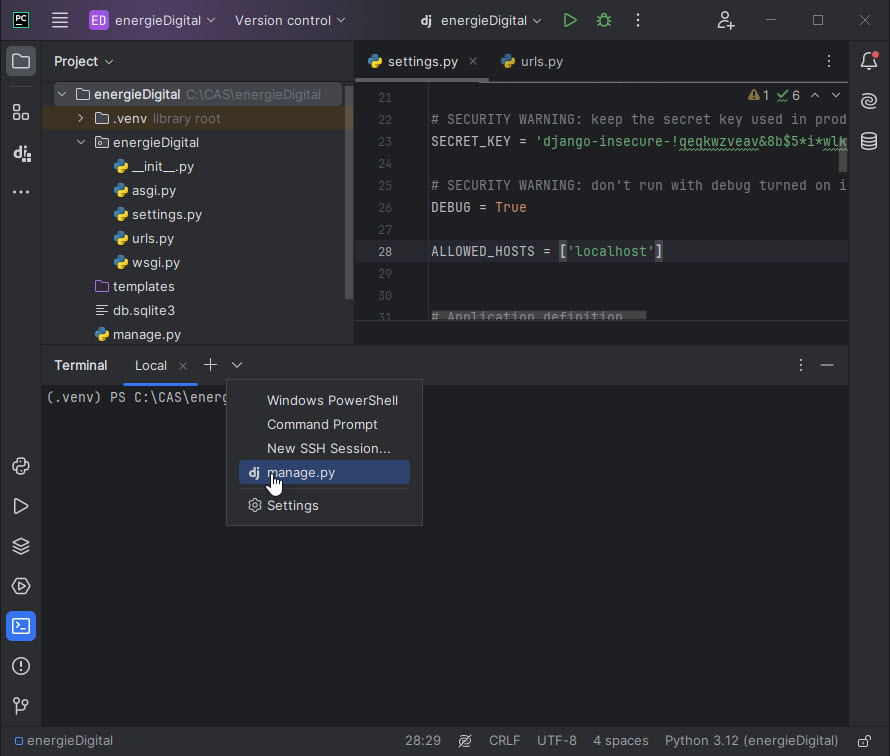

# Visualisierung 1

Um entscheiden und handeln zu können sind Informationen notwendig. Berechnungen oder Modellierungen generieren Informationen in der Regel als Diagramm. Dies ist es was wir mit einer Visualisierung machen; ein Diagramm und noch ein erklärender Text hinzu, nicht zu viel aber ein bisschen macht Sinn.

Denken wir an Energiemonitoring, so sollte die Visualisierung günstig sein, d.h. kein zusätzlicher Bildschirm und PC um den Zählerstand darzustellen. Das günstigste Display ist dies, welches wir bereits dabei haben, das Mobil oder ein Notebook.

Deshalb bauen wir nicht ein eigenes GUI (Graphical User Interface), sondern erstellen eine Webpage. Auf der Messeinheit (z.B. RaspberryPi) läuft ein Server, welcher die Information als Webpage darstellt. Mit dem Mobil oder dem Notebook wird dieser Server "angesurft", welcher die Informationen als Webpage über einen Browser darstellt.

Dabei ist neben der eigentlichen Information, die Darstellung der Webpage wichtig um eine gute Lesbarkeit auf unterschiedlichen Endgeräten (PC, Notebook, Smartphone) zu erreichen. Dies wird als Responsiv Design bezeichnet.


### Leitsatz

Das Bauen einer Website kann zu einer sehr aufwändigen Sache werden, vor allem wenn wir uns in der Gestaltung verlieren. Deshalb ist ein Leitsatz wichtig **Konzentration auf das Wesentliche: Was ist die Kernaussage der Webpage? Design wird "zugekauft"**

Hierfür nimmt man Papier und Bleistift um die Kernaussage zu skizzieren. Eine Verschriftlichung der Kernaussage ist sehr empfehlenswert! Auch hier zählt: Weniger ist mehr. Ein Konzept mit mehr als einem A4 Papier muss nochmals überarbeitet werden. 

Um bei den Webfunktionalitäten nicht alles von Grund auf zu entwickeln verwenden wir ein Webframework. Ein geschriebener Code sollte mehrmals für unterschiedliche Webpages einsetzbar sein. Dieses Prinzip wird als "Don't repeat yourself (DRY)" bezeichnet. Wenig neugeschriebenen Code heisst auch weniger Fehlermöglichkeiten, bessere Wartbarkeit, weniger Abhängigkeiten.

### Webframework

Ein Webframework ist ein Baukastensystem mit einer Vielzahl nützlicher Werkzeuge wie Benutzerverwaltung, Formulare, Upload von Dateien und einen integrierter Entwicklungsserver um die Webpage schnell und einfach darzustellen. Die Teile dieses Baukastensystems können einmal erstellt, für unterschiedliche Anwendungen eingesetzt werden.

Der erste Schritt hierzu ist die Auftrennung von *Information* und der *Darstellung*, wodurch beide Blöcke unabhängig voneinander wieder verwendbar sind. Dieselbe Darstellung mit anderen Informationen oder dieselben Informationen bei unterschiedlicher Darstellung.


Als Webframework verwenden wir **Django** basierend auf Python. Dieses Framework wird bei hunderten von Webpages eingesetzt wie Youtube, Dropbox, Google, Netflix, Spotify, Pinterest, NASA, u.v.m. Der Untertitel von Django heisst *"The web framework for perfectionists with deadlines"* und zeigt die Stärken von Django, wie:

- Schnell umsetzbar mit wenig Code

- Sicherheit inbegriffen

- Skalierbar 

- Vielfach erprobt und bewährt

Django ist benannt nach dem französischen Gitarristen Django Reinhardt.


### Architektur Django

Die Architektur von Django teilt die *Darstellung (Template)* von den *Informationen (Model)*, welche, je nach Anfrage (request) unterschiedlich zusammengebaut, durch eine Steuerung (*View*). Das Konzept wird als MTV bezeichnet für *Model, Template, View* und ist eine lose gekoppelte Struktur, sodass einzelne Teile wiederverwendet werden können.


Diese Model-Template-View-Struktur wird durch die Dateien und Ordner organisiert. Wenn ein Django-Projekt erstellt wird, so werden die Dateien und Ordner angelegt mit all den Funktionen welche benötigt werden. Die einzelnen Dateien werden punktuell auf die eigenen Bedürfnisse angepasst. 

#### Views

Die Views ist die Steuerung bei Django, welche die Webpage zusammenbaut und darstellt, deshalb views. Der Code hierfür liegt in views.py-Datei. In Es werden auch Anfragen (request) vom Browser behandelt, wo die Webadresse geprüft wird. Die Konfiguration ist in der urls.py-Datei.

#### Template

Das Template beinhaltet die Darstellung, das Design der Webpage. Dies wird nicht von Django erstellt, sondern Django sucht im Ordner "templates". Dieses Template werden wir nicht bauen, sondern fertig beziehen. Beispiel für eine Quelle ist [www.html5up.net/eventually](http://www.html5up.net/eventually). 

#### Models

Unter Models werden die Informationen verstanden. Diese werden als Daten in einer Datenbank abgelegt. Um auf die Daten zugreifen zu können sind Datenbankabfragen wie z.B. SQL notwendig, welche kompliziert sind und Django soll jedoch einfach und schnell umsetzbar sein. Deshalb wird die Information als ein "Model" definiert umso auf die Daten zugreifen zu können unabhängig der Datenbankstruktur im Hintergrund. Die Konfiguration liegt in der models.py-Datei. Modelle werden wir  in diesem Tutorial nicht behandeln.

### DjangoGirls

Dieses Tutorial baut auf dem sehr empfehlenswerten Tutorial von [DjangoGirls](https://djangogirls.org/) auf, welches in vielen Sprachen verfügbar ist. Nach eigenem durcharbeiten von Videos, Bücher, Webpages für einen Django-Einstieg bietet DjangoGirls den flüssigsten Einstieg in Django. 

## 1. Lokales Django-Projekt erstellen

Als Entwicklungsumgebung verwenden wir **PyCharm Professional**  von JetBrains, dies ist das Ideale Werkzeug für Python allgemein und vor allem Webanwendungen. Zuvor müssen wir allerdings Python installieren.

Wir erstellen ein Webpage-Projekt auf der nur eine Anwendung (App) läuft, ein Diagramm mit einer Sinusfunktion, dabei kann die Anzahl Perioden eingegeben werden und anschliessend wird ein Diagramm erstellt mit der Sinusfunktion.


Wir öffnen PyCharm und legen ein neues Django-Projekt an mit dem Namen `energieDigital`, PyCharm legt nun das Django-Projekt an mit den Dateien settings.py, urls.py und dem templates-Ordner (es sind noch weitere Dateien, welche wir nicht betrachten).

In **settings.py** bei "ALLOWED_HOSTS" ergänzen wir den url-Namen unserer Seite. Dies können mehrere urls sein, welche zum Aufruf der Seite führen. z.B. Seitenname mit www und ohne www. Wir verwenden den localhost  (oder '127.0.0.1'), da wir mit dem lokalen Entwicklungsserver von Django arbeiten. 

`ALLOWED_HOSTS = ['localhost']`

## 2. Erstellen der App "visual"
Auf einem Web-Portal (Django-Projekt) können mehrere Webseiten laufen wie z.B. Produkt-Dokumentation, Unternehmensbeschreibung, Shop,...Diese einzelnen Seiten werden App genannt. Wir erstellen die App "visual".



In PyCharm gehen wir auf das Terminal recht unten, dort ist ein Pfeilnachunten-Symbol mit welchem wir "manage.py" auswählen. Nun wird die manage.py-Konsole geöffnet. Dort können wir das App visual mit folgendem Befehl anlegen `startapp visual`. In dieser Konsole können weitere Django-Befehle ausgeführt werden, wie z.B. `migrate` um eine Django-Datenbank anzulegen. Hier sieht man den Komfort von PyCharm. 

Dasselbe kann mit einem normalen Terminal ausgeführt werden mit dem Kommando `python.exe manage.py migrate`.

Es wurde nun eine definiert Ordnerstruktur anlegt mit vordefinierte Dateien. Somit weiss Django wo welche Informationen, Funktionen und Daten liegen, ohne dass wir dieses genauer angeben müssen.  Siehe in PyCharm im linken Fenster die Ordnerstruktur an.

```
energieDigital 
   ├── energieDigital  
   │     ├─settings.py
   │     └─urls.py
   └── visual 
         └─views.py
```

Nun können wir unsere Webpage starten mit der grünen Pfeiltaste rechts oben.

Auf der Console erscheinen folgende Zeilen. Es wird der Django-Entwicklungsserver (development server) gestartet und auch die url-Adresse unserer Webpage ist angegeben. Diese geben wir im Browser ein und wir können unsere Seite ansehen.

```
>>python manage.py runserver
Watching for file changes with StatReloader
Performing system checks...

System check identified no issues (0 silenced).
Django version 2.2.5, using settings 'energieDigital.settings'
Starting development server at http://localhost:8000/
Quit the server with CTRL-BREAK.
```

Gratulation! Webserver gestartet und die Seite wird angezeigt.


Nun ist dies die "Standardseite" welche Django liefert. 

## 3. Eigene App gestalten

Wir bauen nun aber unsere eigene App. Django orientiert sich an Ordnernamen und sucht das html-Template im Ordner  "templates", d.h. wir legen im  visual-Ordner  einen Unterordner  `templates`  an und zusätzlich `static` welcher wir später brauchen. Im Django-Projekt "energieDigital" hat es einen Ordner, jedoch sollte die App ein eigenes Aussehen haben, d.h. einen eigenen Ordner. Wir können den Ordner über das Local-Terminal anlegen mit den Windowsbefehl "cd visual" um ins Verzeichnis zu wechseln und mit "md templates" und "md static" um die Ordner anzulegen.

Die Ordnerstruktur sieht nun wir folgt aus:

```
energieDigital 
   ├── energieDigital  
   └── visual
   	     ├── templates 
         └── static
```

### html-Template

In diesem Ordner erstellen wir eine neue Datei  `home.html`.

```html

<html>
    <head>
        <title>Energie digital</title>
    </head>
    <body>
		<h1>Energie digital</h1>
            <p>Beispiel für Visualisierung über Django/Python</a>.</p>
			</header>

        <form method="post" enctype="multipart/form-data">
			
            <input type="number" name="nB2S" value={{ nS2B }} >
			<br>
			
    </body>
```

Im html-Code sind zwei Django-Kommandos eingebaut:

 Dies ist eine Sicherungsfunktion von Django, die Cross Site Request Forgery protection. Bei einer Server-Anfrage (request) wird hier ein csrf-Code mitgeschickt. Wenn später über "post" Daten vom Browser zum Server gesendet werden, so wird dieser csrf-Code mit gesendet und der Server, weiss dann, dass die erhaltenen Daten sicher sind.

 Hier wird der Pfadname geladen, wo die statischen Dateien liegen. Das Diagramm wird als Grafikdatei `sinus.jpg` im Ordner `static` abgelegt. Diese Funktion schreiben wir noch im views.py. 

Mit <input...> definieren wir eine html-Eingabe, wobei wir number definieren, kein Text. Die Eingabe wird mit dem Variablennamen **nB2S** vom Browser an den Server übergeben, deshalb der Name **n**umber**B**rowser**2S**erver. Bei Django kommt dies als Dictioinary an (z.B. dic = {'nB2S:['5']). Beim Aufstarten der html-Seite steht im input-Feld der Wert value={{ nS2B }}. Die Doppelgeschweiften Klammern heissen, dass hier ein Wert von Django eingebaut wird, welcher in der Variabel **n**umber**S**erver**2B**rowser definiert wird. Dies definieren wir im Python-Code in views.ps.

Nun funktioniert unsere Seite noch nicht. Es fehlen noch zwei Punkte:

1. Programmieren der Funktion, welche die Seite erstellt. Dies wird in der Datei **views.py** definiert. Dort läuft unserer Python-Code.
2. Bei der Eingabe der url soll dann diese Funktion aufgerufen werden. Der Aufruf wird in der **urls.py** definiert.

## 3. Erste  Seite

Wir wollen eine App "visual" erstellen mit dem url: **localhost:8000**. Diese Seite soll ein Eingabefeld für eine Zahl haben. Diese Zahl gibt an wieviel Sinuszyklen in einem Diagramm gezeichnet werden sollen. Diese Zahl wird vom Browser zum Server gesendet. Dort wird in python die "sinusfunktion" aufgerufen und mit matplotlib ein Diagramm erstellt und als sinus.jpg-Datei abgespeichert. Anschliessend überarbeitet der Server die html-Webpage, sodass das Diagramm enthalten ist und sendet diese zurück zum Browser, wo das Bild sinus.jpg dargestellt wird.

Nun definieren wir die sinusfunktion in views.py. Hier speichern wir die sinus.jpg-Datei im Ordner "static", damit das html-Template die Datei später findet. Mit der Funktion "render" aktualisieren wir die "home.html". Hier bauen wir mit {{ nS2B }} dynamische Daten ins html ein.  "nS2B" steht für Anzahl Zyklen von Server zum Browser. Die Variablennamen findest du auch im sinus.html.

```python
from django.shortcuts import render
import numpy as np
import matplotlib.pyplot as plt

def sinusfunction(request):
    if request.POST:  # wenn "Enter" gedrückt wird
        dic = request.POST  # Werte von Page übernehmen
        print('mal sehen was das ist: ' + str(dic))
        nB2S = int(dic['nB2S'])
        nS2B = nB2S
    else:
        nB2S = 2
        nS2B = 4

    x = np.linspace(0, 2 * 3.14 * nB2S, 1000)
    y = np.sin(x)
    filename = 'visual/static/sinus.jpg'

    plt.plot(x, y)
    plt.savefig(filename)
    plt.clf()  # Figure-Objekt schliessen, damit nicht zuviel Objekte auf dem Server laufen

    return render(request, 'home.html', {'nS2B' : nS2B,'nB2S' : nB2S})
```


Nun passen wir die **urls.py** an. Unter *url* versteht man die Internetadresse (Uniform Resource Locator). Wir verwenden den lokalen Django-Entwicklungsserver, welcher die Standardadresse "localhost:8000" verwendet, welches wir in der urls.py angegeben sodass die sinusfunction aufgerufen wird. Öffne die `energieDigital/urls.py`-Datei und passe den Code an. 

```python
from django.contrib import admin
from django.urls import path
from visual import views

urlpatterns = [
    path('', views.sinusfunction),
    path('admin/', admin.site.urls),
]
```

Wenn diese Adresse beim Server ankommt wird die Python-Funktion "sinusfunktion" ausgeführt und die home.html-Datei neu gerendert und vom Server an den Browser geschickt.

Nun haben wir einiges angepasst. PyCharm erkennt Änderungen in den Dateien und startet den Webserver neu. Ev. folgt noch eine Fehlermeldung, dass die numpy und matplotlib Bibliotheken nicht installiert sind, d.h. beim Code das Red Bulb Icon anklicken und die Bibliotheken installieren.

Wir können nun die Webpage öffnen mit https://localhost:8000.

## 4. Zusammenfassung

Versuche dies nachzuvollziehen....Passt die Anzahl Zyklen im Eingabefeld mit der Grafik überein? Sieh dir die beiden Variablen nS2B und nB2S an und wie sie funktionieren. Einmal mit {{..}} im html-Code und einmal als dic (Dictionary) in Python.

Die View-Model-Template Architektur von Django sieht nun wie folgt aus:


Die Dateistruktur zeigt sich wie folgt:

```
energieDigital 
   ├── energieDigital  
   │     ├─settings.py
   │     └─urls.py
   └── visual 
        ├── static 
        ├── templates
        │      └─home.html
        └─views.py

```

## 5. Erweiterungen

Wir erweitern die Webpage um zwei Funktionen:

1) Das Diagramm wird nichtmehr als jpg-Datei ins html-Template eingebaut, sondern es wird direkt in views.py ein html-Code generiert über die Bokeh-Bibliothek und diese ans html-Template übergeben.
2) Wir verwenden ein fertiges template von html5up

#### Bokeh

Anstatt matplotlip verwenden wir Bokeh zur Erzeugung von Diagrammen. Dies bauen wir in views.py ein:

```python
from bokeh.plotting import figure
from bokeh.embed import components
```

```python
    p1 = figure(height=400, width=1600, background_fill_alpha=0.8, border_fill_alpha=0.8)
    p1.line(x,y)
    p1.toolbar.logo = None
    [script, div] = components(p1)
    htmlCode = script + div
```

Den Inhalt der Variabel `htmlCode` laden wir in unserem home.html-Template im "body"-Bereich:

```html
{{ htmlCode|safe}}
```

In diesem Code ist ein JavaScript erforderlich um das Diagramm darzustellen. Dieses laden wir vom Internet, welches wir im "head"-Bereich auf definieren:

```
<script src="https://cdn.bokeh.org/bokeh/release/bokeh-3.3.4.min.js" crossorigin="anonymous"></script>
```

### html5up Template

Wir verwendet das Template  [www.html5up.net/eventually](http://www.html5up.net/eventually). Dies besteht aus Darstellungscode im Ordner **assets** und aus Hintergrundbildern, welche im Ordner **images** abgelegt werden. Beide Ordner legen wir in unseren Ordner **static** ab.

Die Hintergrundbilder werden durch die Datei `static/assets/js/main.js` aufgerufen. Das diese gefunden werden, müssen wir dies in dieser Datei anpassen:

```
images: {
    'static/images/bg01.jpg': 'center',
    'static/images/bg02.jpg': 'center',
    'static/images/bg03.jpg': 'center'
},
```

 In unserem home.html-Template erweitern wir im "head"-Bereich den Aufruf der Cascading Style Sheets. 

```
<link rel="stylesheet" href="" />
```

Am Ende des  <body>-Bereichs formatieren wir das Eingabe-Fenster um, sodass es besser sichtbar wird über "style" und wir laden das JavaScript: 

```
        <style>
            input[type=number] {
            box-sizing: border-box;
            border: solid 2px rgba(90, 90, 234, 0.8);
            opacity: 0.80;
            background-color: #ffffff;
            color: #000000;
            }
        </style>
        <script src=""></script>
```

Der Code des Projekts liegt auf Github https://github.com/markstaler/pv4ing/blob/master/visual1/energieDigital.zip

Dieses Tutorial wurde für den Unterricht **CAS Energie digital** erstellt. Markus Markstaler 2024.

