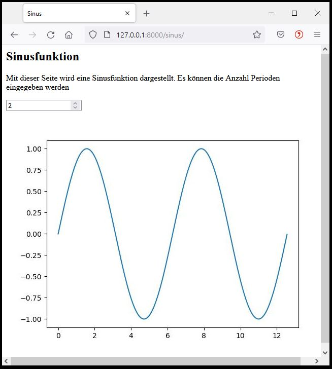
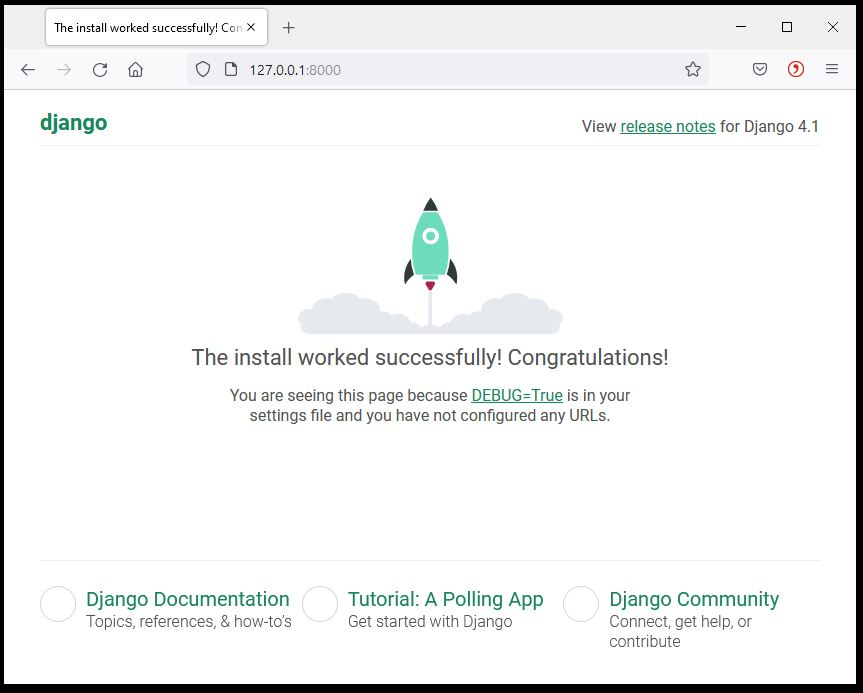

# Visualisierung 1

Um entscheiden und handeln zu können sind Informationen notwendig. Berechnungen oder Modellierungen generieren Informationen in der Regel als Diagramm. Dies ist es was wir mit einer Visualisierung machen; ein Diagramm und noch ein erklärender Text hinzu, nicht zu viel aber ein bisschen macht Sinn.

Denken wir an Energiemonitoring, so sollte die Visualisierung günstig sein, d.h. kein zusätzlicher Bildschirm und PC um den Zählerstand darzustellen. Das günstigste Display ist dies, welches wir bereits dabei haben, das Mobil oder ein Notebook.

Deshalb bauen wir nicht ein eigenes GUI (Graphical User Interface), sondern erstellen eine Webpage. Auf der Messeinheit (z.B. RaspberryPi) läuft ein Server, welcher die Information als Webpage darstellt. Mit dem Mobil oder dem Notebook wird dieser Server "angesurft", welcher die Informationen als Webpage über einen Browser darstellt.

Dabei ist neben der eigentlichen Information, die Darstellung der Webpage wichtig um eine gute Lesbarkeit auf unterschiedlichen Endgeräten (PC, Notebook, Smartphone) zu erreichen. Dies wird als Responsiv Design bezeichnet.


### Leitsatz

Das Bauen einer Website kann zu einer sehr aufwändigen Sache werden, vor allem wenn wir uns in der Gestaltung verlieren. Deshalb ist ein Leitsatz wichtig **Konzentration auf das Wesentliche: Was ist die Kernaussage der Webpage? Design wird "zugekauft"**

Hierfür nimmt man Papier und Bleistift um die Kernaussage zu skizzieren. Eine Verschriftlichung der Kernaussage ist sehr empfehlenswert! Auch hier zählt: Weniger ist mehr. Ein Konzept mit mehr als einem A4 Papier muss nochmals überarbeitet werden. 

Um bei den Webfunktionalitäten nicht alles von Grund auf zu entwickeln verwenden wir ein Webframework. Ein geschriebener Code sollte mehrmals für unterschiedliche Webpages einsetzbar sein. Dieses Prinzip wird als "Don't repeat yourself (DRY)" bezeichnet. Wenig neugeschriebenen Code heisst auch weniger Fehlermöglichkeiten, bessere Wartbarkeit, weniger Abhängigkeiten.

### Webframework

Ein Webframework ist ein Baukastensystem mit einer Vielzahl nützlicher Werkzeuge wie Benutzerverwaltung, Formulare, Upload von Dateien und einen integrierter Entwicklungsserver um die Webpage schnell und einfach darzustellen. Die Teile dieses Baukastensystems können einmal erstellt, für unterschiedliche Anwendungen eingesetzt werden.

Der erste Schritt hierzu ist die Auftrennung von *Information* und der *Darstellung*, wodurch beide Blöcke unabhängig voneinander wieder verwendbar sind. Dieselbe Darstellung mit anderen Informationen oder dieselben Informationen bei unterschiedlicher Darstellung.


Als Webframework verwenden wir Django basierend auf Python. Dieses Framework wird bei hunderten von Webpages eingesetzt wie Youtube, Dropbox, Google, Netflix, Spotify, Pinterest, NASA, u.v.m. Der Untertitel von Django heisst *"The web framework for perfectionists with deadlines"* und zeigt die Stärken von Django, wie:

- Schnell umsetzbar mit wenig Code

- Sicherheit inbegriffen

- Skalierbar 

- Vielfach erprobt und bewährt

Django ist benannt nach dem französischen Gitarristen Django Reinhardt.


### Architektur Django

Die Architektur von Django teilt die *Darstellung (Template)* von den *Informationen (Model)*, welche, je nach Anfrage (request) unterschiedlich zusammengebaut (*View*) werden. Das Konzept wird als MTV bezeichnet für *Model, Template, View* und ist eine lose gekoppelte Struktur, sodass einzelne Teile wiederverwendet werden können.


#### Views

Die Views ist die Programmeinheit bei Django, welche die Webpage zusammenbaut und darstellt, deshalb views. Hier werden auch die Anfragen (request) behandelt und die Webadresse geprüft.

In der allgemeinen Literatur wird das Django-MTV-Modell häufiger als MVC-Modell bezeichnet für Model, View, Control. Hier entspricht View dem Django-Template und Control der Django-Views.

#### Template

Das Template beinhaltet die Darstellung, das Design der Webpage. Dieses Template werden wir nicht bauen, sondern fertig beziehen. Beispiel für eine Quelle ist [www.html5up.net/eventually](http://www.html5up.net/eventually).

#### Models

Unter Models werden die Informationen verstanden. Diese werden als Daten in einer Datenbank abgelegt. Um auf die Daten zugreifen zu können sind Datenbankabfragen wie z.B. SQL notwendig, welche kompliziert sind und Django soll jedoch einfach und schnell umsetzbar sein. Deshalb wird die Information als ein "Model" definiert umso auf die Daten zugreifen zu können unabhängig der Datenbankstruktur im Hintergrund. Modelle werden wir  in diesem Tutorial nicht behandeln.

### DjangoGirls

Dieses Tutorial baut auf dem sehr empfehlenswerten Tutorial von [DjangoGirls](https://djangogirls.org/) auf, welches in vielen Sprachen verfügbar ist. Nach eigenem durcharbeiten von Videos, Bücher, Webpages für einen Django-Einstieg bietet DjangoGirls den flüssigsten Einstieg in Django. 

# 1. Installation

Für die Installation von Django führen wir folgendes Kommando aus, sofern wir mit dem Anaconda Paket arbeiten. Wir öffnen das System-Terminal (bei Windows: Windowstaste und dann cmd eingeben). Der Package-Manager "conda" können wir von einem beliebigem Ordner aus aufrufen weil Conda das Django-Programm an der richtigen Stelle installiert.

```
conda install django
```


# 2. Lokales Django-Projekt erstellen

Wir erstellen ein Webpage-Projekt auf der nur eine Anwendung (App) läuft, ein Diagramm mit einer Sinusfunktion, dabei kann die Anzahl Perioden eingegeben werden und anschliessend wird ein Diagramm erstellt mit der Sinusfunktion.




Wir erstellen einen neuen Ordner `myPage` und gehen mit dem System-Terminal in diesen Ordner. Dort rufen wird das Django-Programm "django-admin" auf, welches uns das Webpage-Projekt anlegt, dabei müssen wir den Namen des Webpage-Projekt angeben (energieDigital).

    django-admin startproject energieDigital .

Der Punkt `.` ist sehr wichtig, weil er dem Django-Programm mitteilt, dass im aktuellen Verzeichnis das Webpage-Projekt installiert werden soll. Ansonst würde ein Ordner mit dem Projektnamen angelegt und darunter das Projekt.

Django organisiert sich mit einer Ordnerstruktur worin vordefinierte Dateien liegen. Somit weiss Django wo welche Informationen, Funktionen und Daten liegen, ohne dass wir dieses genauer angeben müssen.  

### runserver

Nun starten wir die Webpage und geben auf dem Terminal. Wir sind in unserem Ordner `myPage`  und geben folgendes Kommando ins System-Terminal ein:

```
python manage.py runserver
```

Auf dem Terminal erscheinen folgende Zeilen. Es wird der Django-Entwicklungsserver (development server) gestartet und auch die url-Adresse unserer Webpage ist angegeben. Diese geben wir im Browser ein und wir können unsere Seite ansehen.

```
>>python manage.py runserver
Watching for file changes with StatReloader
Performing system checks...

System check identified no issues (0 silenced).
Django version 2.2.5, using settings 'energieDigital.settings'
Starting development server at http://127.0.0.1:8000/
Quit the server with CTRL-BREAK.
```

Gratulation! Webserver gestartet und die Seite wird angezeigt.



Nun ist dies die "Standardseite" welche Django liefert. Wir bauen nun aber unsere eigene Seite. Django orientiert sich an Ordnernamen und sucht das html-Template im Ordner  `templates`, d.h. wir legen in  `energieDigital`  einen Unterordner  `templates`  an. In diesem Ordner erstellen wir eine neue Datei  `sinus.html`.

```html

<html>
    <head>
        <title>Sinus</title>
    </head>
    <body>
        <form method="post" enctype="multipart/form-data">
			
			<input type="number" name="nB2S" value=3>  
			<br>
			
        <form>        
    </body>
</html>
```

Im html-Code sind zwei Django-Kommandos eingebaut:

 Dies ist eine Sicherungsfunktion von Django, die Cross Site Request Forgery protection. Bei einer Server-Anfrage (request) wird hier ein csrf-Code mitgeschickt. Wenn später über "post" Daten vom Browser zum Server gesendet werden, so wird dieser csrf-Code mit gesendet und der Server, weiss dann, dass die erhaltenen Daten sicher sind.

 Hier wird der Pfadname geladen, wo die statischen Dateien liegen. Das Diagramm wird als Grafikdatei `sinus.jpg` im Ordner `static` abgelegt. Diesen Ordner müssen wir ebenfalls anlegen. Wir können probehalber irgendeine Grafik-Datei mit diesem Dateinamen abspeichern.

Diesen Speicherort "static" geben wir in der **settings.py** Datei an als Variabel STATIC_ROOT. In der html-Datei wird der Dateiname mit dem Pfadnamen zusammengebaut durch "". Somit können wir später das Projekt auf irgendeinen Server stellen und die Ordnerstruktur passt, weil der Ort nur an einer Stelle definiert ist, in settings.py.

Nun machen wir die Einstellungen in **settings.py**

### Einstellungen

In der Datei "settings.py" werden die Grundeinstellung der Webpage vorgenommen. . Bei "ALLOWED_HOSTS" ergänzen wir den url-Namen unserer Seite. Wir verwenden den localhost '127.0.0.1', da wir mit dem Entwicklungsserver arbeiten. 

Wir werden eine App erstellen, welche "energieDigital" heisst (gleich wie das Webpage-Projekt). Diese müssen wir bei "INSTALLED_APPS" registrieren, als neuer Baustein in unserem Baukastensystem.

```python
ALLOWED_HOSTS = ['127.0.0.1', 'www.meineSeite.ch']

INSTALLED_APPS = [
'django.contrib.admin',
'django.contrib.auth',
'django.contrib.contenttypes',
'django.contrib.sessions',
'django.contrib.messages', 
'django.contrib.staticfiles',
'energieDigital',
]
```

Nun geben wir noch den Speicherort für unsere Bilddatei "sinus.jpg" an. Hierfür definieren wir die Webadresse für den Server (STATIC_URL) und den Ordner (STATIC_ROOT) worin diese Dateien abgelegt werden. Den Ordner "static" haben wir selber angelegt.

```python
import os

STATIC_URL = '/static/'
STATIC_ROOT = os.path.join(BASE_DIR, 'energieDigital/static/')
```

 Nun funktioniert unsere Seite noch nicht. Es fehlen noch zwei Punkte:

1. Bei der Eingabe der url soll eine Funktion aufgerufen werden welche die Seite erstellt. Der Aufruf wird in der **urls.py** definiert.
2. Die Funktion selbst, welche die Seite erstellt wird in der Datei **views.py** definiert.

## 3. Erste  Seite

Wir wollen eine App "sinus" erstellen mit dem url: **127.0.0.1:8000/sinus**. Diese Seite soll ein Eingabefeld für eine Zahl haben. Diese Zahl gibt an wieviel Sinuszyklen in einem Diagramm gezeichnet werden sollen. Diese Zahl wird vom Browser zum Server gesendet. Dort wird in python die "sinusfunktion" aufgerufen und mit matplotlib ein Diagramm erstellt und als sinus.jpg-Datei abgespeichert. Anschliessend überarbeitet der Server die html-Webpage, sodass das Diagramm enthalten ist und sendet diese zurück zum Browser, wo das Bild sinus.jpg dargestellt wird.

Unter *url* versteht man die Internetadresse (Uniform Resource Locator). Wir verwenden den lokalen Django-Entwicklungsserver, welcher die Standardadresse "127.0.0.1:8000" verwendet, wir wollen jedoch "127.0.0.1:8000/sinus", welches wir in der urls.py angegeben wird. Öffne die `energieDigital/urls.py`-Datei und passe den Code an. 

```python
from django.contrib import admin
from django.urls import path
from . import views

urlpatterns = [
    path('sinus/', views.sinusfunction),
    path('admin/', admin.site.urls),
]
```

Wenn diese Adresse beim Server ankommt wird die Python-Funktion "sinusfunktion" ausgeführt. Diese erstellen wir in der Datei views.py, welche wir noch neu anlegen müssen. Von views importieren wir die "sinusfunktion". 

Nun definieren wir die sinusfunktion in views.py. Hier speichern wir die sinus.jpg-Datei im Ordner "static", damit das html-Template die Datei später findet. Wie erwähnt ist der Pfadnamen in settings.py definiert. Von dort importieren wir diesen mit settings.STATIC_ROOT. Mit der Funktion "render" aktualisieren wir die "sinus.html". Hier bauen wir mit {{ nS2B }} dynamische Daten ins html ein.  "nS2B" steht für Anzahl Zyklen von Server zum Browser. Die Variablennamen findest du auch im sinus.html.

```python
# -*- coding: utf-8 -*-
from django.shortcuts import render
import numpy as np
import matplotlib.pyplot as plt
from django.conf import settings

def sinusfunction(request):
    if request.POST: # wenn "Enter" gedrückt wird
        dic = request.POST # Werte von Page übernehmen
        print('mal sehen was das ist: ' + str(dic))
        nCycle = int(dic['nB2S'])
    else:
        nCycle = int(0)   

    x = np.linspace(0,2*3.14*nCycle,1000)
    y = np.sin(x)
    filename = settings.STATIC_ROOT + 'sinus.jpg'
    
    plt.plot(x,y)
    plt.savefig(filename)
    plt.clf() # Figure-Objekt schliessen
    
    return render(request, 'test.html', {'nS2B': nCycle})
```

Nun starten wir die Webpage und geben auf dem Terminal folgendes Kommando ein:

```
python manage.py runserver
```

Die Webpage öffnet sich mit **http://127.0.0.1:8000/sinus/**.

## 4. Erweiterung

Wir erweitern das Beispiel:

- Als url definieren wir nur die Hauptadresse (ip-Adresse) ohne "/sinus"
- Das Diagramm wird als html-Code direkt ans Template übergeben mit bokeh
- Wir verwenden ein fertiges Template von html5up

In urls.py ergänzen wir wie folgt:

```
urlpatterns = [
    path('', views.chart),
    path('test/', views.testfunction),
    path('admin/', admin.site.urls),
]
```

In views.py schreiben wir den Code zur Darstellung der Sinusfunktion als Funktion 'chart' in welche der Sinus berechnet wird und das Bokeh-Diagramm erzeugt wird.

```python
from django.shortcuts import render
from bokeh.plotting import figure
from bokeh.embed import components
import numpy as np


def chart(request):
    if request.POST: # wenn "Enter" gedrückt wird
        dic = request.POST # Werte von Page übernehmen
        print('mal sehen was das ist: ' + str(dic))
        nCycle = int(dic['nCycle'])
    else:
        nCycle = int(1)   

    x = np.linspace(0,100,100)
    y = np.sin(x/100*2*3.1415*nCycle)    
    p1 = figure(plot_width=460, plot_height=200)
    p1.line(x, y)
    p1.toolbar.logo = None    

    script, div = components(p1) # hier wird html-Code erzeugt
    chart = script + div
        
    return render(request, 'home.html', {'nCycle': nCycle, 'chart': chart})

```

Als nächstes erstellen wir eine Datei home.html. Dies ist die vereinfachte Version vom Template "Eventually" by HTML5up :

```html
<!DOCTYPE HTML>
<!-- Eventually by HTML5 UP -->

<html>
    <head>
        <title>Energie Digital</title>
        <meta charset="utf-8" />
        <meta name="viewport" content="width=device-width, initial-scale=1, user-scalable=no" />
        <link rel="stylesheet" href="" />
        <!-- BOKEH -->
        <script type="text/javascript" src=""></script>    
    </head>
    <body class="is-preload">
        <!-- Header -->
            <header id="header">
                <h1>Energie Digital</h1>
                <p>Programmierbeispiel im CAS Energie digital zu Visualisierung mit Django</p>                                        
            </header>
                <div style="background-color:rgba(0,0,0,0.5);padding: 20px">
                    <form method="post" enctype="multipart/form-data">
                        
                        <input type="number" step = 1 min = 1 max = 20 name="nCycle" value={{ nCycle }} style = color:blue>    
                        {{ chart|safe }}
                        <br>
					  <!-- Diagramm als jpg-Datei, erzeugt über Matplotlib -->
					  <!-- und im Ordner static/images abgelegt -->
					  
                    <form>        
                </div>
        <!-- Scripts -->
        <script src=""></script>
    </body>
</html>
```

Diese referenziert auf css-Dateien und js-Dateien von diesem Template. Diese werden im Ordner `static` abgelegt, dem Ort wo Django standardmässig diese Dateien sucht. Lade das Template "[Eventually](https://html5up.net/eventually)" und speichere die beiden Ordner `immages`und `assets` in den Ordner `static`. Die Ordnerstruktur sieht nun wir folgt aus:

```
energieDigital 
   ├── static 
   │     ├── images
   │     └── assets
   └── templates
```

Öffne die Datei `static/assets/js/main.js` mit dem Editor. Dort siehst du den Verweis auf die Hintergrundbilder `'images/bg01.jpg': 'center',`. Passe den Verweis an, wie folgt, da Django vom Projektverzeichnis ausgeht und unter `static` suchen soll:

```js
images: {
    'static/images/bg01.jpg': 'center',
    'static/images/bg02.jpg': 'center',
    'static/images/bg03.jpg': 'center'
},
```

Speichere im images-Ordner deine gewünschten Hintergrundbilder mit obigen Namen. 

Nun haben wir in views.py ein bokeh-Diagramm erstellt als html-Code. Zur Darstellung braucht es noch die js-Daten von bokeh im `static`Ordner. Diese ist im Internet unter https://cdn.bokeh.org/bokeh/release/bokeh-2.1.1.min.js wobei die Versionsnummer zu beachten ist. **Prüfe die installierte bokeh-Version mit "pip list" und ** passe diese im "home.html" und beim Download an. Der Download funktioniert durch rechte Maustaste "speichern unter" um so die Datei im Ordner `static` abzuspeichern.

Um den Entwicklungsserver von Django zu starten muss auf dem Terminal das Kommando `python manage.py runserver` eingegeben werden. Um nicht zeitaufwändig mit in dem Terminal zum Projektordner zu navigieren und den Server zu starten, kann eine Datei `start.bat` angelegt werden, welche zukünftig das Starten übernimmt: 

```dos
cd pfadname
start cmd /T:0E /K "python manage.py runserver"
```

# 5. Zusammenfassung

Die View-Model-Template Architektur von Django sieht nun wie folgt aus:


Die Dateistruktur zeigt sich wie folgt:

```
D:/djangoProjekt 
   ├── .env
   ├── energieDigital   
   │     ├── static
   │     │      ├── assets...
   │     │      ├── images...
   │     │      └─bokeh-x.x.x.min.js
   │     ├── templates
   │     │      └─home.html
   │     ├─settings.py
   │     ├─urls.py
   │     └─views.py
   ├─db.sqlite3
   ├─manage.py
   ├─requirments.txt
   └─start.bat 
```

Dieses Tutorial wurde für den Unterricht **CAS Energie digital** erstellt. Markus Markstaler 2022.